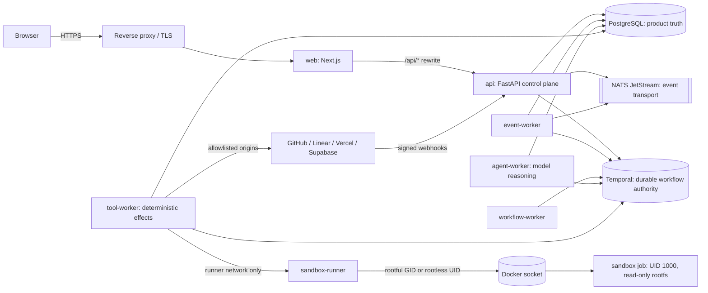

# Architecture index

This page is the map of the shipped system. Each service and trust boundary
has exactly one authoritative document; this index links them rather than
repeating them.

## System overview

| Component | Role | Authority | Document |
|---|---|---|---|
| `web` | Next.js UI; rewrites `/api/*` to the API so cookies stay same-origin | none (presentation) | [conversations](conversations.md), [coordination](coordination.md) |
| `api` | FastAPI control plane: auth, workspaces, agents, grants, approvals, connections, triggers, webhooks, health | control-plane authority; the only writer of configuration | [delegation-and-teams](delegation-and-teams.md), [events](events.md) |
| `workflow-worker` | Temporal worker for general workflows (triggered tasks, sample workflows) | executes durable workflows | [events](events.md) |
| `agent-worker` | Temporal worker for `AgentTaskWorkflow`: model calls, reasoning record, delegation decisions | model reasoning only; never executes connector effects | [tool-worker-boundary](tool-worker-boundary.md) |
| `tool-worker` | Temporal worker on the dedicated tool queue: gateway authorization, approval revalidation, secret resolution, connector calls, sanitization, audit | execution boundary for every deterministic effect | [tool-worker-boundary](tool-worker-boundary.md), [connectors](connectors.md) |
| `event-worker` | JetStream durable consumer: normalizes raw webhook events, matches triggers, starts `TriggeredTaskWorkflow` | event transport consumer | [events](events.md) |
| `sandbox-runner` | Internal-only HTTP service that creates ephemeral job containers; the only service that mounts the Docker socket | execution boundary for `cli.*` tools | [sandboxing](sandboxing.md) |
| sandbox job image | Default ephemeral `cli.*` environment (`docker/sandbox.Dockerfile`), UID/GID 1000, read-only root | none | [sandboxing](sandboxing.md) |
| PostgreSQL | System of record for every user-visible state | product truth | [memory](memory.md), [media](media.md) |
| NATS JetStream | Durable event transport with at-least-once delivery and dedupe layers | transport, never the only record | [events](events.md) |
| Temporal (+ optional UI) | Durable workflow engine; histories are the authority for in-flight runs | workflow authority | [tool-worker-boundary](tool-worker-boundary.md) |

## Data and authority

- **PostgreSQL is product truth.** Tasks, runs, messages, grants, approvals,
  connections, triggers, audit events, conversations, memory, and media all
  live there. A Temporal history or NATS message is never the only record of
  user-visible state.
- **Temporal is the durable workflow authority.** Agent runs, triggered
  tasks, delegation chains, and approval waits are Temporal workflows;
  pause/resume/cancel map to signals; worker restarts resume from history.
- **NATS JetStream is the event transport.** Raw webhook events and
  normalized canonical events flow through streams with durable consumers;
  idempotency keys and dedupe layers make redelivery safe.
- **The API is the control-plane authority.** Workers read configuration
  from PostgreSQL that only the API writes.
- **Tool gateway and sandbox runner are the execution boundaries.** Model
  output becomes an effect only after the tool worker authorizes it against
  live grants and approval state.

## Security boundaries

| Boundary | Rule | Enforced by |
|---|---|---|
| Docker socket | Only `sandbox-runner` mounts it, as non-root UID 10001 with either the socket's supplementary GID (rootful) or a UID-10001 rootless daemon (rootless); jobs never receive it; startup fails closed on UID 0, symlinks, wrong owner/group, or privileged mode | `compose.rootful.yaml`, `compose.rootless.yaml`, `services/sandbox_runner`, `tests/integration/test_phase10_sandbox_socket_modes.py` |
| Secrets | Envelope encryption with a file-mounted master key; the key is mounted only into `api`, `agent-worker`, `tool-worker`; values are never returned after creation or logged | `packages/secrets`, `packages/observability` redaction |
| Reasoning vs execution | `agent-worker` never holds connector credentials or executable catalogs; `tool-worker` never calls a model | `tests/test_worker_dependency_boundaries.py`, `tests/test_executable_catalog_boundary.py` |
| Network segmentation | `edge` (web, api), `control` (NATS, Temporal, workers), `data` (PostgreSQL), `runner` (tool-worker to sandbox-runner only), `sandbox` (internet-policy jobs only) | `compose.yaml` |
| Outbound targets | Connector traffic only to built-in SaaS origins or exact operator-allowlisted origins/hosts | `packages/connectors/.../endpoints.py` |
| Production manifest | No fake service, dev credential, fixture database, or dev allowlist renders from `compose.yaml` alone | `scripts/assert_phase9_production_compose.py`, `scripts/assert_phase10_tool_worker_compose.py` |
| Workspace isolation | Every query is workspace-scoped; roles gate administration | `apps/api`, `tests/integration/test_phase2_api.py` |
| Webhooks | Signature verification, delivery dedupe, and replay protection before publication | [events](events.md) |

Full details: [sandboxing](sandboxing.md) and
[tool-worker-boundary](tool-worker-boundary.md). Deployment-facing
consequences are in the [deployment guide](../deployment.md).
