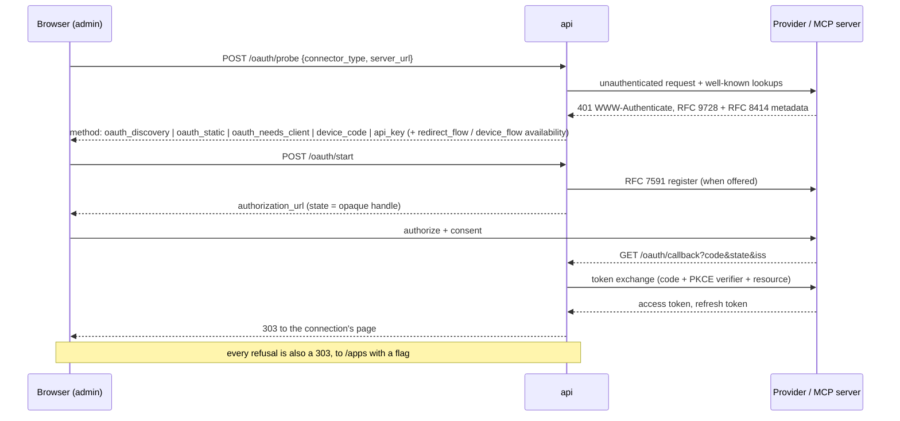

# Connecting an app without a pasted token

An API key is a bearer credential a person copies out of one system and into
another. It does not expire, it cannot be scoped after the fact, and revoking
it means finding it again wherever it was pasted. This document describes the
path that replaces it: a person presses **Connect**, approves Jhin on the
provider's own site, and a token arrives on Jhin's side without ever crossing
a screen.

The protocol is OAuth 2.1 with PKCE, RFC 8414 discovery, RFC 7591 dynamic
client registration, RFC 8707 resource indicators, RFC 9207 issuer
identification, and RFC 8628 device flow. The rules that bind them for MCP
servers come from the MCP authorization specification (2026-07-28), and where
that specification and general OAuth practice disagree, the MCP rule wins —
those servers are the ones Jhin discovers rather than ships knowledge of.

Related: [mcp.md](mcp.md) for what an MCP connection is,
[connectors.md](connectors.md) for how credentials are resolved at tool time,
[tool-worker-boundary.md](tool-worker-boundary.md) for which process may hold
a master key.

## The shape of it

Only the callback is a public route. Everything else is workspace-scoped and
admin-only.

| Route | Who | Why |
| --- | --- | --- |
| `GET /api/v1/oauth/redirect-uri` | any authenticated user | the one URI to paste into a provider's app settings |
| `GET /api/v1/oauth/callback` | public | the provider redirects a browser here |
| `GET /api/v1/oauth/github-app/callback` | public | GitHub's app-manifest return (an *install* lands on `/apps`, not here) |
| `POST …/oauth/probe` | `apps:write` | answers "does this server speak OAuth?" and which flows can start; returns no credential material |
| `POST …/oauth/start` | admin, session-only | returns a URL that a browser turns into a token |
| `POST …/oauth/device/start`, `…/device/poll` | admin, session-only | holds a device code |
| `GET/POST/DELETE …/oauth/clients` | admin, session-only | stores a client secret |
| `POST …/oauth/github-app/manifest` | admin, session-only | produces a form that creates one |

The five write routes are **sealed**: browser-session-only, never reachable
with an API key, forever. Everything that mints, holds, or hands out material
that becomes a credential is on that list — see
`apps/api/src/jhin_api/access/route_scopes.py`, which is the authority.

## Ask the server, do not guess

`POST /oauth/probe` makes one unauthenticated request to the MCP server and
reads the answer. The catalog's `auth_hint` is **not** consulted: it is a
label for the Apps library, written by whoever indexed the server, and it is
wrong more often than right as a routing signal. A protocol fact comes from
the protocol.

The probe returns one of five methods, and the Connect dialog renders itself
from that answer rather than from anything it assumed beforehand:

- `oauth_discovery` — the server offers DCR, or this workspace already has a
  client registered at that issuer. Press Connect and go.
- `oauth_static` — a native connector whose provider is in the shipped table
  and whose registration can start the browser redirect. Press Connect and
  go; the sign-in code is one link away.
- `oauth_needs_client` — the server speaks OAuth but will not register Jhin
  automatically, or a registration exists that cannot do the redirect. The
  Connect panel asks for the app once (for GitHub, it can create one).
- `device_code` — a native connector whose provider offers RFC 8628, offered
  first only when the registration has no client secret or the operator set
  `OAUTH_PREFER_DEVICE_CODE`.
- `api_key` — no OAuth on offer. The `reason` field distinguishes
  `no_oauth_offered` from `discovery_failed` and `server_url_not_allowed`,
  because "this server does not do OAuth" and "Jhin could not reach it" are
  different problems with different fixes.

`method` is the *preferred* flow. For a static provider the probe also
reports both flows — `redirect_flow` and `device_flow`, each `{available,
reason}` — so the panel can offer the other as a quiet link rather than
guess at it. `reason` is a closed vocabulary (`needs_client_credentials`,
`needs_client_secret`, `no_device_endpoint`); `needs_client_secret` means a
registration exists but cannot do the redirect, because the provider
authenticates a confidential client and no secret is stored. The top-level
`reason` carries the same code when it is why `method` is not `oauth_static`.

Native connectors cannot be probed — GitHub publishes no discovery document
at all — so their protocol facts come from a reviewed table,
`jhin_connectors.oauth_providers.STATIC_PROVIDERS`. An entry there is a fact
about a provider's endpoints (and, for GitHub, the page where a person
manages the apps they own, `app_settings_url`, validated on the way out and
only ever rendered as a link), never a credential. A connector with no entry
answers `api_key`, which is the honest answer for a connector with no OAuth.

## One redirect URI, and it never varies

There is exactly one callback URI per instance, derived from settings by
`jhin_api.oauth.redirect` and recomputed at every call site. It is never read
back from a request or a row.

This is the single most load-bearing decision in the flow. A redirect URI
that varies has to be matched loosely by the provider, and loose redirect
matching is how open redirectors are built. So every distinguishing fact
about an authorization — which provider, which workspace, which connection,
where the user was — travels in the opaque `state` handle and is looked up
server-side.

`redirect_uri` is stored on the pending authorization at start time and
compared byte-for-byte at callback time. An operator who changes
`OAUTH_REDIRECT_BASE_URL` mid-flow gets a refusal rather than a token bound
to the wrong URI. It is also part of the client registration's key, so the
same change forces a fresh registration instead of silently presenting a
stale one.

`app_return_url` is the only function permitted to build a `Location` header
for a browser leaving the callback. It takes settings and a public id,
refuses a public id that is not thirty-two hex characters, and has no
parameter through which a request-supplied string could reach it.

## What the callback checks before it spends a code

In order, and all of them:

1. **The `state` handle names a live row.** Only `sha256(state)` is stored,
   so a database read grants nobody the ability to complete somebody else's
   pending authorization. Thirty-minute TTL, single use.
2. **The live session is the user who started it.** This comparison is the
   load-bearing CSRF defense — not the state parameter, which only proves the
   request came back from where it was sent.
3. **`iss` matches the issuer captured before redirecting** (RFC 9207,
   mandated by MCP 2026-07-28), when the server advertised the parameter. The
   issuer compared against is the *validated* one — the value that
   byte-matched the metadata document's own `issuer` field.
4. **`redirect_uri` still matches**, byte for byte.
5. **The row was minted for this flow.** A pending row records the flow that
   created it, and each endpoint claims only its own: a `device_code` or
   `github_app_manifest` handle presented to the OAuth callback is refused
   outright rather than surviving to be stopped incidentally by a later check.
   The device routes bind the **workspace** as well, because they are
   workspace-scoped and the connection is created in the row's workspace —
   without it, somebody who administers two workspaces could drive one
   workspace's authorization through the other's URL.

Then the code is exchanged with the PKCE verifier and the `resource`
indicator. A failed exchange spends the pending row and the user is told to
start again from a page Jhin controls. GitHub reports a refused exchange with
**HTTP 200** and the error in the body, exactly as its device flow does;
`exchange_code` classifies that body like any refusal, and the callback logs
`oauth.code_exchange_failed error_code=…` with the code from the closed
vocabulary. (Refresh keeps its existing classification, which reads the
status code; classifying HTTP-200 bodies there is a follow-up.)

Provider error text is never rendered, returned, or embedded in an exception
anywhere in this subsystem. An authorization server's `error_description` is
attacker-influenced prose. The machine-readable code — narrowed to
`jhin_oauth.errors.KNOWN_ERROR_CODES` — selects one of Jhin's own sentences
instead.

**No refusal has a body.** `complete_authorization` returns a
`CallbackResult` on every path and raises nothing; the handler has one
`return` and it always builds a 303 from `app_return_url`. There is no code
in this route that can put JSON in a browser — including the validation
errors the query parameters used to raise, which is why the bounds moved off
the signature into the handler. This closes the defect an operator hit head
on: they clicked Connect and got
`{"detail": "This connection attempt is no longer valid. Start again from Apps."}`
in the address bar, with no way forward.

**Two tiers, and the boundary is the security boundary.** Everything decided
*before* the single-use claim succeeds gets one flag, `expired`,
byte-identical — unknown, expired, already-spent, another user's, another
workspace's, another flow's, malformed, over-long. Anybody with any session
can reach that tier, so it says nothing. A caller with no session gets
`signed_out` before the database is touched at all, which reveals only that
they sent no cookie.

Everything decided *after* the claim may name a cause, because `claim`
returns a row only when the row's `user_id` matches the live session:
reaching that tier requires the raw 256-bit handle **and** the owner's
browser — the pair that could have completed the flow. Four of those flags
name a fact about instance configuration or a stored registration
(`redirect_changed`, `registration_gone`, `client_rejected`,
`callback_mismatch`) and are additionally gated on the caller still being a
workspace admin, because `claim` binds to a user id and a membership can be
revoked mid-flow. The full set is
`signed_out | expired | denied | failed | issuer_mismatch | client_rejected |
callback_mismatch | redirect_changed | registration_gone`; the web app turns
each into a sentence Jhin wrote, in a card whose primary control starts the
thing the person was trying to do.

**Thirty minutes, not ten.** `OAUTH_STATE_TTL_SECONDS` is `1800`. One round
trip can contain an SSO login at the edge, a provider sign-in with a second
factor, a consent screen somebody reads, and a GitHub App installation
picker. It is the fourth control in front of this route, not the first, and
it is the only one lengthening touches. It also buys legibility: GitHub's
authorization *code* lives ten minutes, so under a ten-minute state a
twelve-minute round trip died at the claim as an indistinguishable
`state_expired`; under thirty it reaches the exchange and fails as
`invalid_grant`, which `oauth.code_exchange_failed` names outright.

**A prefetch is not a navigation.** A request carrying `Sec-Purpose:
prefetch`, `Purpose: prefetch`, `X-Moz: prefetch`, or a
`Sec-Fetch-Mode`/`Sec-Fetch-Dest` that is not a document navigation is
answered `303 → /apps` before anything is looked up, and claims nothing. A
browser sending none of those headers is treated as a navigation — absence
never costs a real callback.

**The wrong-session claim is released, not committed.** `claim` consumes the
row inside the transaction before it checks the binding; `_replay_or_refuse`
rolls that back. Committing it would let a callback delivered into the wrong
browser destroy the right one's in-flight authorization. Single use is
unaffected — the winner among genuine concurrent callbacks is still decided
by one atomic statement.

**Everything is logged, and only in the log.** `oauth.callback_refused`
carries `reason` from a closed vocabulary, `flow`, and `connector_type` when
a row was claimed — and nothing else: no handle, no hash, no code, no
provider prose, no issuer, no ids. Which check failed is a question the
server may answer and the browser may not, so it is answered here and nowhere
else. Deciding it costs one read-only `SELECT` after the conditional `UPDATE`
has already lost; that query changes nothing, its answer reaches no response,
and a failure in it degrades to `state_unknown` rather than to a 500.

### What each `reason` means

| `reason` | What to do about it |
| --- | --- |
| `state_expired` | the round trip is outrunning `OAUTH_STATE_TTL_SECONDS` |
| `state_consumed` | something spent the state first — a prefetch, or a duplicated navigation |
| `state_unknown` | a handle this instance never minted, or one purged after four hours |
| `no_session` | the browser session died while the person was at the provider |
| `redirect_uri_changed` | `OAUTH_REDIRECT_BASE_URL` or `APP_URL` moved mid-flow |
| `issuer_missing`, `issuer_mismatch` | RFC 9207: the `iss` returned is not the one we talked to. The value compared against is the provider's `authorization_response_iss` when the static table declares one (GitHub says `https://github.com/login/oauth` while its registrations stay keyed by `https://github.com`), otherwise the recorded issuer |
| `endpoint_blocked` | `JHIN_CONNECTOR_ALLOWED_HTTP_ORIGINS` no longer allows a stored endpoint |
| `exchange_refused` | read `oauth.code_exchange_failed` beside it for the provider's code |
| `provider_denied`, `no_code` | the person declined at the provider |
| `wrong_user`, `wrong_workspace`, `wrong_flow`, `state_malformed`, `param_too_long` | a handle presented by the wrong browser, from the wrong workspace, at the wrong endpoint, or in the wrong shape |
| `registration_missing`, `verifier_missing`, `connection_not_created`, `internal_error` | Jhin's own fault; the sibling event says more |

## A callback that arrives twice

The OAuth `state` is single-use by design, and a browser spends it more than
once for reasons nobody chose: a link prefetch, a refresh, a back-button, a
Cloudflare Access re-issue in the middle of the round trip. The second
request found no row and was refused — even when the first request had
created the connection perfectly. The person was told their sign-in link was
dead while looking at a connection that existed.

So a consumed row keeps a **receipt**: one `outcome` string from a
ten-value vocabulary a check constraint pins down, and one
`outcome_connection_id` pointing at the connection the flow concerns. At the
same instant it forgets the PKCE verifier (the `secret` row is deleted and
`verifier_secret_id` nulled), the draft payload, and the pending reconnect
pointer. It holds no secret at any point in its life.

`retain_until` is how long the receipt is honoured —
`OAUTH_CALLBACK_RECEIPT_TTL_SECONDS`, ten minutes by default, clamped to an
hour in code, `0` to disable receipts entirely. It is a second column rather
than a reuse of `expires_at` because the two windows answer different
questions: `expires_at` is how long the row may be *claimed* — the security
bound — and `retain_until` is how long a spent row is *kept*. Conflating
them would force one number to be both. `purge_expired` reads only
`retain_until`, so a sweep cannot take a receipt out from under a refresh
already in flight.

What the callback may do with one is build the same `Location` the first pass
built. Nothing else: no exchange, no token, no write, no refresher, no
`reveal_verifier`. Five properties make that safe.

1. **Addressable only by the handle** — `recall` looks up `sha256(handle)`.
2. **Bound to the row's own user** — the same predicate `claim` applies.
3. **Holds no secret** — see above.
4. **Discloses only a projection of what the session already sees** — a
   connection's `public_id` is returned by `GET …/connections`. If the
   connection was deleted, `ON DELETE SET NULL` empties the pointer and the
   replay lands on plain `/apps`.
5. **Produces nothing** — and it does not extend `retain_until`, so it is not
   a sliding window.

The landing a receipt renders as is recomputed on every replay, so the
admin gate above is honoured for a demotion that happened after the fact.

Under READ COMMITTED a second callback's `UPDATE` blocks on the winner's row
lock, re-evaluates the predicate after the winner commits, misses, and then
reads the winner's committed receipt — so a prefetch racing a real navigation
resolves to two identical success landings and one connection. The honest
cost: the winner does not commit until after the token exchange, a network
round trip, so the loser holds a database connection for that duration. That
is pre-existing, and the prefetch guard is what keeps it rare.

## What is stored, and what is not

Two tables, one rule between them: **nothing here holds credential
material.** The DCR client secret, the PKCE verifier, and the device code are
encrypted through `jhin_secrets` and referenced by `secret` row id, exactly
as connection credentials already are.

| Table | Row | Key |
| --- | --- | --- |
| `oauth_client_registration` | one workspace's client identity at one authorization server | `(workspace_id, issuer, redirect_uri)` |
| `oauth_authorization` | one pending authorization: 30-minute claim window, single use, then a 10-minute receipt | `sha256(state)` |

Registrations are **never shared between workspaces**. Workspaces are Jhin's
tenancy boundary everywhere else, and a client secret reaching across one
would let a compromise in one workspace reach another's provider account.

The tokens themselves are an ordinary credential secret behind the
connection's `encrypted_secret_id`. What sits in columns on `connection` is
the non-secret shape of the grant — `oauth_issuer`, `oauth_resource`,
`oauth_scope`, `oauth_expires_at`, `oauth_refresh_expires_at`,
`oauth_refresh_failures`, `oauth_authorized_by_user_id` — so the refresher
can find work and the Apps page can explain itself **without decrypting
anything**.

`oauth_resource` is the RFC 8707 audience the tokens were issued for. The MCP
executor compares it against the server URL at use time, so a token cannot
follow an edited URL to a different server.

That value is always `canonical_resource_uri(server_url)` — the canonical URI
of the MCP server itself, which is what the MCP authorization spec requires
and what the executor recomputes before every call. It is deliberately **not**
the `resource` field of the protected-resource document: RFC 9728 lets one PRM
cover a whole subtree, so a server at `https://host/mcp` may legitimately
publish a document naming `https://host`, and storing that would mint a
connection whose recorded audience can never match the URL being dialled. A
provider with no resource concept at all — a statically-known one such as
GitHub, whose access comes from the app installation — records the empty
string, and the `resource` parameter is then **omitted** from the
authorization and token requests rather than sent blank, because RFC 8707
requires an absolute URI and a strict server answers `invalid_target`.

`oauth_authorized_by_user_id` records whose provider account the tokens
belong to. Every agent holding a grant to that connection acts with that
person's permissions, so the product says whose, on the connection, to
whoever asks.

## Staying connected

Two halves, in two different processes, for one reason: the renewer needs
both a master key and the code path that is about to use the token.

**The proactive sweep.** `OAuthRefreshWorkflow` — one durable Temporal
workflow per workspace, on the agent queue, cadence
`OAUTH_REFRESH_INTERVAL_SECONDS` (default 300). Its single activity lives in
`jhin_agent_worker.oauth_activities`. Each window it asks one bounded
question — which connections expire within the horizon — and renews them,
**each in its own transaction**, so one provider's bad minute cannot roll
back another connection's rotated refresh token. It returns a tally rather
than raising: a revoked grant is a fact for the Apps page to show, not a
reason to fail the sweep against every other connection.

**Refresh-on-use.** `jhin_tool_worker.oauth_refresh`, installed into
`jhin_connectors.execution` at tool-worker startup. It runs inside the tool
call that needs the token, under the row lock `ConnectionTokenService` takes,
so two workers reaching the same connection together produce **one** token
request rather than two — which matters, because a second request against a
rotating provider invalidates the first's refresh token.

It is *installed* rather than imported because the dependency runs one way:
`jhin_oauth` builds on the connectors package's outbound URL policy, so the
connectors package must not import `jhin_oauth` back. It lives in the tool
worker because that is the only process that both runs connector tools and
holds a master key — the agent worker deliberately does not depend on
`jhin_connectors` at all. A process that installs no renewer still resolves
connections and still refuses a dead one correctly; it simply leaves renewal
to the sweep.

A transient failure increments `oauth_refresh_failures`. A **terminal**
failure sets the connection to `needs_reauth` and zeroes the counter rather
than counting, because retrying a dead grant only trips provider abuse
detection. `needs_reauth` is its own status, distinct from `error`, because
the cure is specific and a person has to perform it: somebody must authorize
the app again. An agent that hits one gets a sentence naming the app and the
fix, never a provider 401 it cannot interpret.

## Disconnecting

Deleting Jhin's copy of a token is not the same as ending the grant: a
provider keeps honouring an access token nobody told it to forget, and a
refresh token can outlive the row that referenced it by months. So deleting
an OAuth connection calls `ConnectionTokenService.revoke_and_clear` first —
refresh token then access token, at the issuer's revocation endpoint when it
published one.

Revocation is **best-effort and erasure is not**. A provider that is down
must never stop an admin from disconnecting an app, so a failed revocation is
suppressed and the local secret is destroyed regardless. A provider that
publishes no RFC 7009 endpoint at all — GitHub, which retires a token through
an authenticated REST call on the app instead — simply has nothing to call,
and the erasure half still runs.

Reconnecting is the opposite operation and deliberately does *not* delete
anything: the row's id is what every grant, trigger, and recorded tool call
points at. Only the manifest-declared settings travel into the new
authorization; the server-side bookkeeping on `config_json` is re-derived
from the connection, and the discovered tool list and risk overrides are
carried across untouched. The path is one: `POST
/connections/{id}/reauthorize` → `start_authorization` → the browser
redirect for a native connector, discovery for an MCP server. A connection
first made with a device code reconnects through the redirect too, which is
why a GitHub registration needs a client secret for reconnect as well as for
the first browser sign-in.

## Which sign-in a native provider gets

The rule is short: **browser sign-in first whenever the registration can do
it; the sign-in code one link away; nothing is ever the only button on a
dead screen.**

| Registration at the provider | Offered first | Also offered |
| --- | --- | --- |
| client id + secret | browser redirect (`oauth_static`) | the code, when the provider has a device endpoint |
| client id, no secret | the code (`device_code`, `reason: needs_client_secret`) | the browser sign-in, one paste of the secret away |
| nothing registered | register the app (`oauth_needs_client`) | — |
| any, with `OAUTH_PREFER_DEVICE_CODE=true` | the code | the browser sign-in |

The setting only reorders; it never removes a flow and never affects MCP
servers. A provider's device endpoint makes the code *available*; it never
demotes the redirect (`_static_provider_probe` decides, not the field's
truthiness).

The browser sign-in is primary on every instance, loopback included, for
three reasons. GitHub redirects the *browser* that just loaded Jhin at
`APP_URL`, so any origin that browser can reach — `http://localhost:3000` on
the same machine — is one it can be sent back to. The redirect needs no
toggle on GitHub's side: a GitHub App with a client secret can do it the
moment it exists. And a plaintext public origin is already refused at
startup, so there is no instance where the redirect is primary *and* unsafe.

**Device flow** (RFC 8628) is the alternative. A client id and nothing else:
no redirect URI and no client secret, at start, at poll, or at refresh. GitHub
answers a not-ready poll with **HTTP 200** and the error in the body, so the
status code alone never decides anything; `slow_down` raises the polling
cadence permanently. GitHub only serves the device flow to apps that have
**Enable Device Flow** ticked in their settings, and a GitHub App created
from Jhin starts with it **off**. So when GitHub refuses the start with
`device_flow_disabled` and the registration can do the browser sign-in, the
refusal says to use the browser sign-in instead, and the panel offers it in
the same place; the checkbox on GitHub is named only when no browser sign-in
is possible — a registration with no secret (`oauth.device_start_refused` in
the log carries the provider's code either way).

The poll's `410` and `400` are answers to an XHR into a panel that is already
on screen with its own retry button, not to a navigation, so they stay
statuses rather than becoming redirects. Both are now treated as **terminal**
by the panel: a `400` follows the row being deleted server-side, and telling
somebody the code "is still valid — try again" sent them to wait on a handle
that no longer existed. Every device-poll refusal is recorded as
`oauth.callback_refused` with `flow="device_code"`, so one grep answers "why
did nothing connect" for every flow.

**GitHub app-manifest provisioning.** The operator clicks once, GitHub
creates this instance's own GitHub App, and a single exchange returns its
client id, client secret, webhook secret, and private key. Nothing is copied
by hand and no secret crosses a screen. The manifest declares the narrowest
permission each declared connector capability needs, derived from the
capability list so it cannot drift wider than the tools that exist — adding a
capability without mapping a permission is a build-time error, not a silently
under-permissioned app. `callback_urls` holds exactly one entry: this
instance's single constant redirect URI. No wildcard, no second entry,
nothing derived from a request.

The landing is `/apps?github_app=created`, which opens Connect GitHub: the
app was created so that GitHub could be connected, and the next screen is
the consent step. `request_oauth_on_install` is **false** — with it on,
GitHub would follow an install with a state-less authorization code at the
OAuth callback, which has no pending row to bind it to and refuses it by
construction. `setup_url` is `/apps`, and the page reads only `setup_action`
(`install` | `update`) from what GitHub appends, never `installation_id`.
The manifest callback treats a dead session exactly as the OAuth callback
does — nothing claimed, a redirect to `/apps?oauth_error=signed_out` — and
treats every other pre-claim refusal that way too: a claim that fails lands
on the shared recovery page with the identical bytes, so neither callback can
be used as an oracle for the other. Only a failure *after* the claim lands on
`?github_app=failed`.

One-click creation needs the instance's own origin to pass the outbound
policy, because the manifest embeds it. `GET /oauth/redirect-uri` reports
that as `github_app_available`; a loopback install that is not allow-listed
registers by hand instead, with the permissions the same route lists
(`github_app_permissions`, derived from the same capability map) so a by-hand
app never drifts from what the manifest would have asked for.

Only the `client_id` and `client_secret` are kept from the conversion, as an
ordinary `client_secret_post` registration keyed by `https://github.com`.
The app id, private key, and webhook secret are discarded: the `github_app`
(installation-token) credential scheme is a separate, hand-provisioned
credential and this path does not provision it. Installing the app on an
account or organization is a consent GitHub offers no API for, so the
consent step says where to do it (the person's GitHub Apps page) and
`verify` says when it has not been done — a user-to-server token reaches
only repositories the app is installed on.

The one-time conversion code *is* the credential, is single-use, and expires
an hour after the form is posted. Every returned secret is registered with
the process redactor at the moment of first possession, before anything else
can fail, so a later shape error still cannot leave it unredactable.

## Outbound requests

Every URL in this subsystem — discovered, configured, or constructed — goes
through `jhin_oauth.urls.validate_oauth_url`, which delegates to the shared
`jhin_domain.endpoints` policy (public `https` origins, or an exact
operator allow-list entry in `JHIN_CONNECTOR_ALLOWED_HTTP_ORIGINS`) and then
re-asserts the two rules OAuth depends on: no userinfo, no fragment, and
`https` unless that exact origin was allow-listed. The re-assertion is
deliberate duplication — the guarantee must hold even if the shared
validator's scheme rule is ever loosened for another connector's sake.

Only the *authority* is normalized. The shared validator rewrites an empty
path to `/`, which is harmless for a connector call and fatal here: an issuer
is compared byte for byte against the metadata document that claims it, and
RFC 8414 issuers routinely have no path at all.

Token and metadata requests **never follow redirects** — a 3xx on a token
endpoint moves a request to a host the policy never approved — read bounded
response bodies, and time out quickly so one slow provider cannot hold a
worker slot.

An `AuthorizationServerMetadata` in hand is therefore a document whose URLs
have already passed policy. It is constructible only through
`parse_authorization_server_metadata` or
`jhin_connectors.oauth_providers.provider_metadata`, both of which validate
before they build, and every value object in `jhin_oauth.types` is frozen and
slotted: a metadata document, a client registration, or a token set is a fact
about a moment, and nothing downstream may edit one in place.

## Settings

| Setting | Default | Notes |
| --- | --- | --- |
| `OAUTH_REDIRECT_BASE_URL` | `""` | empty means "use `APP_URL`", right for every deployment where the browser reaches the API through the web app's rewrite proxy. On a loopback origin, `JHIN_CONNECTOR_ALLOWED_HTTP_ORIGINS` must list it for one-click GitHub App creation; the browser sign-in itself needs no allow-list |
| `OAUTH_STATE_TTL_SECONDS` | `1800` | thirty minutes, not ten: one round trip can contain an SSO login at the edge, a provider sign-in with a second factor, and an app-installation picker. The handle is 256 bits, single-use, and bound to the initiating user's session, so this is a defence-in-depth bound rather than the control that stops a forged callback. Refused at startup outside 60–3600 |
| `OAUTH_CALLBACK_RECEIPT_TTL_SECONDS` | `600` | how long a *consumed* authorization remembers what it produced, so a refresh or a prefetch that spent the state does not cost somebody the connection they made. Holds no secret; readable only by the session that could have completed the flow; clamped to 3600; `0` disables |
| `OAUTH_CLIENT_NAME` | `Jhin` | `client_name` sent during DCR; what the user sees on the consent screen |
| `OAUTH_REFRESH_INTERVAL_SECONDS` | `300` | proactive sweep cadence |
| `OAUTH_PREFER_DEVICE_CODE` | `false` | offer the sign-in code before the browser sign-in for a native provider that can do both; never removes a flow; does not affect MCP |
