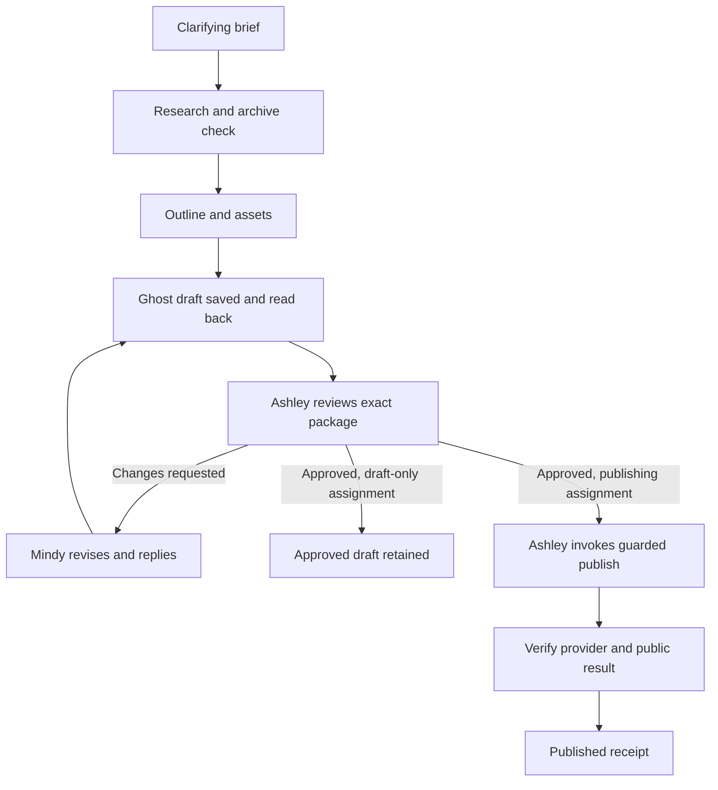

# Mindy and Ashley Marketing Showcase Implementation Plan

> **For agentic workers:** Implement this plan task by task using `superpowers:subagent-driven-development` or `superpowers:executing-plans` when available. Track the checkboxes and preserve other contributors' work. This document is a complete handoff: read its behavioral specification, implementation tasks, and acceptance criteria before changing code.

**Goal:** Make Jhin's existing Marketing team do real editorial work: Mindy clarifies an assignment, researches the Fanclan archive and external sources, prepares an illustrated Ghost draft, exchanges substantive feedback with Ashley, revises it, and remembers useful information at the appropriate scope. Ashley alone has authority to approve and publish through Jhin.

**Architecture:** Extend Jhin's existing agents, native Ghost connector, encrypted scoped variables, curated memory, work requests, durable workflows, and chat artifacts. Models make editorial decisions; server code enforces identities, permissions, state transitions, credential isolation, and exact-version publication. Add the missing archive/research layer and Unsplash integration without building a second agent runtime or editorial approval system.

**Tech stack:** Existing Python 3.13/uv workspace, FastAPI, SQLAlchemy/Alembic, PostgreSQL, Temporal, NATS, and Next.js/React/TypeScript with pnpm. Use existing HTTP, secret, policy, model, artifact, and observability packages.

**Spec:** The user's request and the embedded behavioral specification in sections 1–12 of this document. Sections 13–17 are the implementation and verification plan.

**Inspection date:** September 15, 2026, America/Los_Angeles. Repository findings describe the inspected working tree, including uncommitted changes. They do not prove the running installation matches it.

## 1. Outcome and scope

The successful demonstration is a real conversation with Mindy that produces a useful article in Ghost, a traceable Ashley review, a revision exchange, and evidence of appropriate memory and credential reuse in a later conversation. A transcript in which one model pretends to speak for both employees does not count.

The production demonstration ends with an Ashley-approved **draft** on `https://blog.fanclan.io`. The implementation must also prove actual publication by Ashley on an isolated Ghost installation. Publishing on the real Fanclan blog is a separate later assignment; this plan is not permission to publish there.

Interpret “Ashley is the only person with permission to publish” as the only publishing identity inside this Jhin workflow. Ashley is an agent. Ghost owners and other credentials outside Jhin remain outside Jhin's enforcement boundary; do not claim Jhin can prevent them from operating Ghost directly.

### Required behaviors

1. The existing Ashley and Mindy are discovered by persistent IDs, with Mindy reporting to Ashley in Marketing. Do not recreate them from names or reset the user's workspace.
2. Mindy asks useful follow-up questions, remembers answered preferences, and never invents missing credentials, an Admin URL, a publication instruction, or factual research.
3. Every accessible published article is included in an auditable archive inventory. Similarity analysis operates across that inventory and reads relevant article bodies in depth.
4. Mindy learns API usage from current official documentation and records what she learned with sources and timestamps.
5. Credentials are supplied securely and used inside the tool worker. Models and colleague messages see references and status, never secret values.
6. A real draft is created and updated through Ghost. “Saved” means a successful provider response and a read-back of the resulting post.
7. Ashley reads the actual review package, gives a structured decision, and can request actionable revisions. Mindy makes changes and replies to Ashley with evidence.
8. Only Ashley can approve publication and invoke the guarded publish operation. A user asking Mindy to publish does not grant Mindy that capability.
9. Approval binds to the exact draft, assets, metadata, destination, and release intent. Edits invalidate it.
10. Cross-conversation memory and variable reuse work at agent, team, and company scope with current access checks.
11. Waiting, retries, crashes, cancellation, revocation, and external edits produce truthful, recoverable states.
12. The user sees real research, artifacts, questions, exchanges, and results through normal Jhin surfaces.

### Boundaries

- Implement one excellent end-to-end editorial slice. Multi-blog publishing, bulk campaigns, newsletter delivery, social distribution, analytics optimization, and automatic recurring posting are later extensions.
- Scheduling exists elsewhere in Jhin; do not expand it unless necessary to preserve the draft-only restriction for existing schedules.
- Use current configured model profiles for live acceptance. Record which profile and version were tested; do not silently replace the user's models.
- No hardcoded article, fake successful tool result, fabricated review, or scripted Mindy/Ashley conversation in the live demonstration.
- No production post deletion, live article modification, Ghost settings change, subscriber email, or workspace reset as test cleanup.
- Keep stored content local to the existing self-hosted architecture. Any embedding/model egress follows the workspace's configured data policy.

## 2. Current implementation and gaps

Read these files before implementing. Paths below are repository-relative for portability; proposed new paths are explicitly marked later.

| Area | Existing implementation | Work still required for this showcase |
|---|---|---|
| Ghost | `packages/connectors/src/jhin_connectors/ghost/{client,schemas,tools,setup,access,manifest,connector}.py` | Extend and verify; do not rebuild. Native draft, revision, review, and publisher operations already exist. |
| Editorial truth | `packages/db/src/jhin_db/models/editorial.py`; `apps/api/src/jhin_api/connections/editorial.py` | Add assignment/release-intent and research-package references while keeping `GhostEditorialReview` authoritative for provider approval. |
| Ghost read surface | `ghost/schemas.py`, `ghost/tools.py` | Current output exposes basic fields and HTML, truncated to 60,000 characters. Ashley needs inspectable images, captions, authors, tags, SEO fields, and explicit completeness information. |
| Archive reading | `ghost.post.list` supports pagination, at most 30 items per call | A complete, restartable inventory and efficient retrieval are missing. Thousands of articles should not be copied into one model prompt. |
| Human questions | `packages/tools/src/jhin_tools/ask_person.py`; API questions module; agent workflow | Reuse required questions and durable answers; add structured editorial brief collection and image-selection questions. |
| Agent collaboration | `services/agent_worker/src/jhin_agent_worker/coordination_activities.py`; `packages/workflows/src/jhin_workflows/work_request_task/workflows.py` | Native Ghost review creates real child work. Repair durable continuation after a result arrives beyond the current short requester wait. |
| General reviews | `packages/tools/src/jhin_tools/reviews.py` | A generic `organization.review.request` is not sufficient to dispatch Ashley or authorize Ghost publication. Use the native Ghost editorial route. |
| Scoped configuration | `packages/secrets/src/jhin_secrets/variables.py`; `packages/tools/src/jhin_tools/variables.py`; API variables module | Agent/team/company ordinary and encrypted values already exist. Improve task-aware scope choice and minimal usable grants. |
| Memory | `packages/memory/src/jhin_memory/`; `packages/tools/src/jhin_tools/memory.py`; agent platform prompt | Existing curation protects source visibility. Add prospective reusable storage authority, explicit team destinations, and better editorial evidence handling. |
| Secure intake | Existing chat secret capture and “Send a secret” UI | Reuse the pre-persistence boundary for Unsplash. Do not ask for keys in ordinary chat text. |
| UI | `apps/web/components/editorial/reviews-panel.tsx`; `apps/web/lib/editorial-reviews.ts`; chat and variable components | Current review display is incomplete; external image preview is blocked by its existing image CSP. Add complete safe preview and clear review/revision cards. |
| Unsplash | No native connector found during inspection | Add a narrow connector and a provider-compliant selection experience. |

Two especially important findings must have regression tests: the current Ghost review handoff explicitly tells the director to publish after approval, without a persisted draft-only disposition; and the publisher restriction is per connection, so multiple connections to one Ghost installation can designate different publishers. Neither is sufficient for the requested behavior.

Historical context: `docs/superpowers/plans/2026-09-12-agent-work-readiness.md` and `docs/testing/agent-work-live-2026-09-12.md` describe earlier live Ghost, memory, variable, and collaboration acceptance. That report also says the workspace was subsequently reset. Treat its sample IDs and pass counts as historical evidence, not current acceptance or IDs to reuse.

The public [Fanclan blog](https://blog.fanclan.io/) displayed tag counts of 4,267 posts during inspection. This is a scale signal, not a verified unique-post total; the authenticated archive inventory must establish the actual count.

### Architecture choice

| Approach | Tradeoff | Decision |
|---|---|---|
| Extend native tools and durable coordination | Reuses existing trust boundaries and yields reusable product behavior | Recommended. |
| Give Mindy general HTTP/terminal access and a prompt saying “draft only” | Flexible, but raw credentials or arbitrary requests can bypass editorial controls | Reject for privileged Ghost operations. |
| Build a separate marketing service with its own agents, vault, and approvals | Duplicates state and complicates recovery and access control | Unnecessary for this slice. |

## 3. Roles and authority

### Mindy — Blogger

Responsibilities: clarify the brief; research coverage and sources; propose an original angle; draft and revise; prepare image requests; select appropriate internal links; save Ghost drafts; request Ashley's review; answer feedback; propose useful memories.

She can inspect permitted sources, use authorized connections, write assignment artifacts, and edit drafts assigned to her. She cannot approve her own article, publish or schedule it, send newsletters, change publisher identity, expand her grants, or obtain another agent's private data.

### Ashley — Marketing Director

Responsibilities: guide the angle and positioning; answer Mindy's editorial questions; verify originality and sources; inspect content and images; request revisions; approve the exact final package; publish only when the assignment permits publication.

Ashley can request work from Mindy and review her output. Her managerial relationship informs collaboration, but the explicit grants and designated publisher record confer tool authority. Her title alone does not.

### Permission matrix

| Operation | Mindy | Ashley | Other agents |
|---|---|---|---|
| Read Marketing editorial memories/artifacts | Yes, within current membership and grants | Yes | Only explicit access |
| Use shared Ghost credential through permitted native tools | Yes | Yes | No default grant |
| Reveal raw Ghost or Unsplash secret | No | No | No |
| Research archive and documentation | Yes | Yes | Only explicit access |
| Create/edit this assignment's draft | Yes | Prefer revisions through Mindy; permitted edits invalidate approval | No default grant |
| Request Ashley's editorial review | Yes | May initiate review work | No authority implied |
| Give authoritative approval | No | Yes, identified by immutable agent ID | No |
| Publish | No | Yes, with current grant, exact approved version, and permitted release intent | No |
| Reconfigure publishing identity or grants | No | No autonomous self-service expansion | No |
| Broaden a secret's audience | Only within explicit storage authority | Only within explicit storage authority | No default authority |

The owner/admin manages setup through existing authenticated controls. Owner approval of a general tool call must not substitute for Ashley's editorial approval. Renaming another agent “Ashley,” giving it a director persona, or fabricating an Ashley message cannot confer authority.

## 4. Conversational brief and setup

### First conversation

Example user request: “Mindy, create a blog post for Fanclan.”

Mindy first reads relevant accessible preferences and assignment context. She then asks a compact first batch, ideally four to six questions, with sensible suggested answers:

1. “Do you have a topic, or should I suggest three gaps after checking the archive?”
2. “Who should this help, and what should readers do afterward?”
3. “What tone and approximate length do you want?”
4. “Should it include images: none, a cover, or a cover plus inline images?”
5. “Are there required points, sources, keywords, internal links, or topics to avoid?”
6. “Is there a deadline?” Ask for timezone only if a deadline needs it.

Do not ask the user to restate facts already known: Fanclan's blog URL, Ashley's role, and the default draft-only outcome are specified here. Do not turn optional SEO metadata or a missing deadline into a blocker. Ask narrower follow-ups only where answers materially affect the work.

If the user delegates the topic choice, that is a valid answer: Mindy researches and proposes an angle or selects one within the delegated brief. If the user delegates tone/length, Mindy records her chosen defaults as assignment decisions, not permanent preferences asserted to come from the user.

### Persisted brief

Create an `EditorialAssignment` record associated with the task and conversation. Persist these fields with revision numbers:

| Field | Meaning |
|---|---|
| `workspace_id`, `team_id`, `writer_agent_id`, `publisher_agent_id` | Actual verified identities and scope |
| `blog_connection_id`, `public_blog_url` | Chosen connection and public destination; Admin URL remains connection configuration |
| `topic_mode`, `topic`, `angle`, `audience`, `goal`, `cta` | Requested or explicitly delegated editorial choices |
| `tone`, `language`, `word_count_min`, `word_count_max` | Writing constraints; unset optional values are distinguishable from defaults |
| `image_mode`, `image_selection_mode` | Requested assets and provider-approved selection path |
| `must_include`, `must_avoid`, `preferred_sources`, `keywords` | Concrete editorial constraints |
| `due_at`, `timezone` | Optional deadline in UTC plus original IANA timezone |
| `release_intent` | `draft_only` by default; `publish_after_ashley_review` only from authorized explicit instruction |
| `source_message_ids`, `decision_provenance`, `brief_version` | Where each answer or delegated choice came from |
| `editorial_version`, `version` | Readiness/content revision versus ordinary optimistic-lock version; progress/delivery updates do not change `editorial_version` |
| `phase`, `blocked_reason`, `resume_condition` | Current truthful work state |

Changing a publication-related constraint or article angle after review invalidates readiness. Any change to `release_intent` requires a new review bound to the new intent. Do not silently turn a draft request into publication because the user later says “looks good.”

### Secure setup sequence

1. Discover existing authorized Ghost and image connections. Report “configured,” “needs verification,” or “missing” from actual data.
2. If Ghost is missing, request the **actual Ghost Admin URL** and an Admin integration key through secure input. The public blog URL is not proof of the Admin origin. Ghost documents that these domains can differ. [Ghost Admin API](https://docs.ghost.org/admin-api/)
3. Present a clear storage recommendation: “Use a Marketing-scoped connection so Mindy can draft and Ashley can review; only Ashley will have publish access.” Bind the key to the approved connection, field, and origin.
4. Obtain an Unsplash Access Key through the same secure intake when that integration is selected. Do not request an OAuth Secret Key unless a future feature actually requires OAuth.
5. Verify each credential with a narrow read operation. Verify Ghost site identity and the configured public destination before allowing a write.
6. Save only verified configuration facts and opaque references. A failed verification is not a remembered successful setup.
7. Once supplied, do not request the same key again unless it is revoked, missing, or invalid.

Credential-only messages use the existing required setup gate. Do not start unrelated research/delegation while required setup questions from that flow remain unresolved. In ordinary article assignments with no credential-only gate, independent public research may proceed while secure setup is pending, but no credential-dependent call may proceed.

## 5. Archive research and originality

### What “research all posted articles” means

Ingest every accessible published article's identity, metadata, and complete available body into a durable local corpus. Compare the proposed topic against the entire corpus, then give Mindy full relevant sections/articles for deep reading. This does not require a single model invocation to read thousands of articles, and it must not claim absolute originality or a plagiarism guarantee.

Use the authenticated Ghost listing as the authoritative inventory when available. A public sitemap/archive crawl is a fallback, useful for reconciliation, but cannot prove completeness for inaccessible or unlisted content. An RSS feed or homepage sample is not an archive inventory.

### Corpus design

Add `BlogCorpusSync` and `BlogCorpusDocument` records scoped by workspace and connection. Store original content in existing managed artifact/blob storage, with searchable normalized text and bounded summaries. Do not save the archive as thousands of permanent company memories.

Each document includes: provider post ID; canonical URL; slug; title; tags; authors; status; published/updated times; full-content artifact reference; normalized-content hash; extraction version; summary; topics; retrieval index version; last-seen sync; and coverage/error state. Keep unpublished material in an explicitly restricted partition if separately needed for duplicate draft detection.

Each sync includes: connection; start/end timestamps; high-water mark; page cursor; expected/seen counts; successful, skipped, failed and deleted IDs; bytes processed; retry count; index version; and `complete`, `partial`, `running`, or `failed` status.

### Sync procedure

1. Enumerate published posts in a stable order with pagination. Persist each page and its progress before advancing.
2. Fetch complete content through worker-side APIs; the current model-facing HTML truncation must not become an indexing boundary.
3. Deduplicate by provider ID and normalize content deterministically. Unchanged content reuses its existing analysis.
4. Build full-text retrieval and, where configured, embeddings. Keep source documents authoritative; a summary or embedding is only an index.
5. Because paginated APIs may not offer snapshot isolation, reconcile IDs/counts and posts changed during the scan. Repeat bounded reconciliation if the archive changes. Never equate “visited every page once” with a consistent snapshot.
6. Mark completeness only when the discovered inventory, fetched bodies, and reconciliation agree. A body truncation, failed page, or unknown gap makes coverage partial.
7. On later assignments, perform an incremental update plus periodic full ID reconciliation to catch deletions and status changes. Initial defaults: refresh changes at assignment start; reconcile all IDs at least daily while actively used.
8. Check for newly relevant posts again before final review. If coverage is incomplete, Mindy can continue a provisional draft, but cannot report a completed originality check. Ashley's final ready verdict requires resolved coverage for this showcase.

Start with two concurrent provider reads, at most three retries for retryable reads, exponential backoff and jitter, and provider-directed delay when supplied. Yield/checkpoint long work. These are configurable Jhin limits, not assertions about provider quotas.

### Originality report

Mindy produces a versioned report containing:

- Corpus version, source connection, inventory count, coverage state, scan time, and documented gaps.
- Topic, intended audience, search intent, proposed thesis, and why this angle helps readers.
- The closest 5–10 existing articles with links, relevant sections, overlap explanation, and the new contribution.
- Exact-title/slug checks, lexical overlap, semantic overlap when available, and excerpt comparisons.
- A recommendation: proceed, change angle, update an existing article, or ask the user.
- Suggested internal links and why they fit.

Do not use a single similarity percentage as the editorial verdict. Calibrate near-duplicate fixtures for titles, paraphrases, overlapping outlines, and distinct articles sharing terminology. If the requested article already exists, Mindy should explain the overlap and propose a useful alternative rather than rewrite it with synonyms.

## 6. Documentation and factual research

Mindy must actually retrieve official documentation through Jhin's research tools during the demonstration, rather than merely use knowledge from her system prompt. Use existing `web` read/search tools where available; add bounded fetch/extract support only for demonstrated gaps.

For Ghost and Unsplash, save a compact `DocumentationNote` artifact with source URL, retrieval date, provider/API version when available, supported operation, auth handling, request/response shape, pagination/error behavior, and relevant restrictions. Save a concise reusable team memory only if appropriate; link to the full artifact.

Documentation is untrusted reference material. API examples containing `status: published` must not override Mindy's draft-only tool policy. Do not execute scripts from documentation, install arbitrary packages from a page, send secrets to a suggested new endpoint, or turn document text into tool authorization.

For the article itself, collect a source ledger: URL, publisher, retrieved date, claim supported, short notes, and any uncertainty. Prefer original sources for product features, prices, policies, and statistics. Conflicting or unavailable evidence is made visible to Ashley. Do not invent first-hand experience, customer quotes, interviews, author credentials, or evidence of an API call.

Every source entry must reference a server-created retrieval receipt containing the actual tool-call ID, final validated/canonical URL, retrieval time, content artifact/hash, excerpt offsets, completeness, and access classification. Cache permitted content or bounded source excerpts under the existing retention policy. Notes written by a model are separate commentary; a URL plus those notes is not proof of a fetch. Review packages bind to immutable receipt versions, while fresh revalidation produces a new receipt.

Research cache defaults: revalidate API notes older than seven days when starting new integration work, and revalidate immediately after a schema/auth incompatibility. Time-sensitive article claims are checked again for the draft being reviewed. The user can set stricter freshness requirements.

## 7. Unsplash and image handling

### Provider constraint to resolve explicitly

Unsplash's published guidance requires a non-automated experience, and says applications should not require their users to create their own developer accounts. Its guidance gives embedded Ghost image selection as a valid integration example. These rules need to inform both the requested personal setup and any later public Jhin offering. [API guidelines](https://help.unsplash.com/en/articles/2511245-unsplash-api-guidelines), [experience guideline](https://help.unsplash.com/en/articles/2511256-guideline-high-quality-authentic-experiences), [embedded integration examples](https://help.unsplash.com/en/articles/2511257-guideline-replicating-unsplash)

Implementation decision: default to an owner-initiated image search and an actual human selection from results. Mindy prepares the visual brief and proposed search terms, then handles placement, alt text, attribution, and review after selection. Do not treat Ashley's agent decision as human selection. Fully autonomous Unsplash selection remains disabled unless the operator has provider confirmation covering that use; record that confirmation as configuration evidence. Human selection is a conservative design choice, not a claim that it alone guarantees provider acceptance.

The live run must explicitly record which mode was exercised. If the user wants full autonomy immediately, use user-owned/preapproved assets or an authorized alternative image provider as a separate agreed path. Do not silently skip the requested Unsplash verification and call it complete. The implementation agent should not contact Unsplash on the user's behalf without authorization.

### Narrow connector

Add `unsplash` in the existing connector layout. Proposed operations:

| Tool/operation | Inputs | Result |
|---|---|---|
| `unsplash.photos.search` | Connection, assignment, query, page, orientation, bounded result count, persisted search authorization | Sanitized candidates and pagination |
| `unsplash.photos.get` | Connection and photo ID | Verified metadata for a selected candidate |
| `unsplash.photos.select` | Assignment, candidate/photo ID, current asset version, persisted authorized selection ID | Asset record plus tracking receipt/status |

Selection authorization is loaded server-side from a real human selection record or approved provider-mode configuration. A model-supplied `human_approved=true` flag is never authority.

Use server-side `Authorization: Client-ID …` against the fixed Unsplash API origin. Search/read tools use typed parameters, current grants, bounded pages, and rate-limit responses; credentials never appear in image URLs. [Unsplash API documentation](https://unsplash.com/documentation)

### Asset record and rendering

Persist photo ID; source page; image URL; photographer name/profile; attribution HTML; alt text; caption; width/height; intended placement; query; selection actor/time; provider compliance mode; and tracking status. Record editorial suitability independently of the photographer's generic description.

Display API-returned hotlinked image URLs rather than uploading copies to Ghost or routing image bytes through a caching proxy. Preserve provider-required query parameters. Validate image and tracking hosts independently; never forward credentials to a candidate-supplied arbitrary URL. [Hotlinking guideline](https://help.unsplash.com/en/articles/2511271-guideline-hotlinking-images)

Record the provider download event when an image is actually selected for use, using its validated download-location endpoint. Previewing candidates is not the same event. Deduplicate locally by selection event; an ambiguous provider response is recorded as uncertain rather than retried indefinitely with a claim of exactly-once delivery. [Download tracking guideline](https://help.unsplash.com/en/articles/2511258-guideline-triggering-a-download)

Include visible photographer and Unsplash credits with referral links wherever the selected photo is shown, including candidate cards and the final article. Verify that the Ghost theme renders feature-image attribution; include a visible body credit if needed. [Attribution guideline](https://help.unsplash.com/en/articles/2511315-guideline-attribution)

Fanclan's subject matter makes image context important: do not imply that a stock-photo subject is a named creator, customer, or endorser. Prefer relevant non-identifying conceptual imagery unless specific assets are supplied. Ashley reviews misleading implications as well as visual quality.

If no suitable image is found, present a clear choice: revise the query, use an owned asset, or change the brief to no images. An image-required assignment cannot become ready with a missing asset hidden from the user.

## 8. Draft, review, revision, and release

### Deliverable package

Create immutable versions of these linked artifacts:

1. Accepted brief and decisions.
2. Archive coverage and originality report.
3. Source ledger and claim notes.
4. Outline and final article body.
5. Image manifest with selection and attribution evidence.
6. Ghost metadata: title, slug, excerpt, tags, author, feature image/alt/caption, SEO title/description, canonical URL if intentionally set, and content visibility.
7. Provider draft receipt, post ID, provider timestamp, content revision, and authenticated editor/preview link where supported.
8. Ashley's rubric/verdict and each Mindy revision response.

Store artifacts using existing managed file/version APIs. Do not return a guessed public URL as a working draft preview. Draft preview tokens/URLs are restricted artifacts, not company memories or public activity text.

### Ghost API behavior

Keep the existing typed draft operations. Explicitly write `status: draft` and forbid arbitrary status fields, arbitrary endpoint paths, scheduling, newsletter parameters, and email-only options in Mindy's surface. Add missing metadata fields through allowlisted schemas.

Both draft creation and update require a current assignment binding, authorized writer/editor identity, uncancelled state, and appropriate version. A successful create binds the returned post ID to that assignment; subsequent updates cannot target a different assignment's post. Legacy unbound writes on this protected installation fail closed and require an authorized assignment-binding migration or new assignment, rather than silently retaining wider privileges.

Ghost supports HTML input conversion, but the rendered result may differ. Read back the provider-rendered body and validate formatting, links, images, and metadata before requesting review. Verify the intended Ghost author rather than accepting an unintended default owner attribution. [Creating posts](https://docs.ghost.org/admin-api/posts/creating-a-post)

Updates use the last observed provider `updated_at`; a conflict requires rereading and a new review where applicable. Preserve complete tag and author relations when updating. [Updating posts](https://docs.ghost.org/admin-api/posts/updating-a-post)

This slice performs web publication only. Do not add newsletter query parameters or test email delivery. Ghost's email behavior is a separate operation with separate effects. [Sending posts by email](https://docs.ghost.org/admin-api/posts/sending-a-post)

### Review routing

Use `ghost.review.request` to create Ashley's real review work through the existing coordination path. Include the assignment ID and an immutable review-package version. Ashley gets her own task, model invocation, identity, tool trace, and result.

Ashley reads the current provider draft and full review package. A truncated excerpt cannot satisfy the read prerequisite; large content must be available through explicit chunks/artifact reads with completeness receipts.

Her rubric covers: brief fit; audience usefulness; original contribution; factual support; brand voice; structure; natural internal links; image relevance and attribution; metadata; preview quality; and requested output/release intent. A numeric score is optional; explicit blocking findings are required.

Verdicts:

- `changes_requested`: includes stable issue IDs, severity, specific requested change, rationale, and verification expectation.
- `approved`: no unresolved blocking findings; exact reviewed package and provider revision are recorded.

Example feedback: “R2: The second section claims this feature is available to every user, but the cited source describes a limited rollout. Qualify the claim and update the comparison table.”

Mindy responds with each issue ID, what changed, the new artifact/provider revision, and any disagreement supported by evidence. She resubmits the new version; she cannot mark Ashley's request approved herself. Ashley verifies fixes and may identify new issues.

Start with a maximum of three substantive revision rounds per assignment. This is a configurable loop bound. If unresolved, explain the remaining decision to the owner; do not auto-approve, abandon silently, or ask an unrelated agent to impersonate a replacement director.

### State model

`EditorialAssignment.phase` is the user-facing orchestration state. `GhostEditorialReview.status` remains the authority for approval/publication; do not duplicate its independent truth.



Any active phase can enter `blocked` with a reason and resume condition, or `cancelled`. Track the prior resumable phase. Long waits do not mean task failure. An uncertain provider write must be reconciled before another write.

### Publish guard

Every publishing attempt must revalidate, immediately before the effect:

1. The actor is the persisted designated Ashley ID, active in this workspace and authorized by a current explicit grant.
2. The assignment binds this writer, publisher, connection, post, and destination; the connection is active and still bound to the approved origin.
3. `release_intent` permits publication and was set from an authorized instruction. Draft-only assignments fail closed.
4. The specific `GhostEditorialReview` is approved by Ashley for the current provider revision and current review-package hash, with required review-read evidence.
5. The current Ghost post is still an unpublished draft; reread it and compare both content and provider version.
6. The brief, source report, image manifest, destination, publisher config, and grants have not changed in a way that invalidates readiness.
7. No operation with the same publication identity is completed or has an unresolved ambiguous outcome.

Use a row lock/compare-and-set around the local claim and Ghost's provider version check for external concurrency. A local lock alone cannot prevent a Ghost Admin user editing the post. Never update a live post under a “draft edit” capability.

Block alternate routes: generic HTTP, MCP, CLI/curl, shell environment injection, alternate connections for the same site, agent delegation, and organizational admin tools must not let Mindy use a publication-capable credential or redefine authority. Default marketing grants exclude arbitrary credential-bearing HTTP/CLI operations. If other grants must coexist, enforce the same resource-aware gate at those execution boundaries.

## 9. Memory and configuration scope decisions

### Three different things

- **Memory:** an enduring preference, fact, or lesson useful for future reasoning.
- **Variable/configuration:** an operational value used by tools, possibly sensitive.
- **Artifact/task record:** a particular article, research corpus, review, API receipt, or conversation outcome.

Do not use long-term memory as a secret store, article database, or replacement for a connection record. A memory may link to an authorized connection or artifact without containing the credential or full document.

“Personal” maps to the existing `agent` scope: Mindy's private information is not automatically available to Ashley because she is Mindy's manager. Team means the explicit Marketing team ID; company means the current workspace/company, never every Jhin tenant.

### Decision procedure

For every candidate durable item, produce a small internal `StorageDecision`: classification, proposed destination and ID, reason, provenance, sensitivity, confidence, applicable authority, and retention/revalidation rule.

1. Determine whether the item should be persisted at all. Temporary guesses and failed setup claims are not durable facts.
2. Detect credentials/sensitive content before storage and before any external classifier/embedding call. Store credentials only through the encrypted variable/secret boundary.
3. Determine who needs the fact or capability for the work. Choose the narrowest sufficient scope.
4. Evaluate source visibility and prospective sharing authority. Knowing a fact in private chat does not itself authorize company disclosure.
5. Apply current scope membership, read/write/use grants, and denied scopes. The model's recommended audience cannot override server policy.
6. Save or propose through existing curation. Report the actual outcome: saved, pending review, rejected, or needs scope confirmation.
7. Record supersession and conflicts. New preferences do not silently overwrite stronger authoritative policy.

### Reusable authority instead of repeated questions

Existing memory policy requires human scope grants for broader ordinary-chat memories. Preserve that default, but add an explicit prospective storage policy during setup, for example:

“Remember editorial style, approved recurring preferences, and article-planning lessons for Marketing. Keep personal feedback private. Company-wide facts and broader credentials require separate authority.”

Persist who granted this policy, allowed information classes, destination team ID, permitted actors, effective-from time/source-message boundary, expiry/revocation, and source restrictions. It authorizes eligible future extracts, not publication of the entire private chat or retroactive promotion of old private memories. Company facts can receive a similarly explicit policy if the owner chooses.

Support an explicit team destination in `memory.propose`; do not guess from an agent's primary team when the assignment belongs to another permitted team. Current-source evidence limitations must be addressed with authorized source-message/artifact references, not by trusting a model-written quotation.

### Example decisions to demonstrate

| Information | Destination/type | Reason |
|---|---|---|
| Mindy's personal working note about her own drafting process | Mindy agent memory | Only Mindy needs it; not a company rule |
| “Our blog uses a friendly, practical tone and avoids exaggerated claims” | Marketing memory after authorized source/policy | Shared editorial practice |
| Ashley's one-off correction of a fact in draft v2 | Assignment review first | Not every correction is a permanent preference |
| A recurring editorial lesson confirmed by Ashley | Marketing memory under allowed lesson policy | Useful to future articles with provenance |
| Owner-confirmed Fanclan product positioning for all departments | Company memory under company-sharing authority | General company fact |
| User private performance feedback about Mindy | Restricted original context; agent memory only if appropriate | Management hierarchy does not widen access |
| Blog public URL and content language | Marketing ordinary variable; company only if needed there | Operational configuration |
| Ghost Admin API key | Encrypted Marketing variable bound to native Ghost connection | Both agents need permitted use; neither needs the bytes |
| Unsplash Access Key | Encrypted connection credential at authorized scope | Provider credential, not ordinary text |
| Mindy-only experimental API key | Encrypted Mindy variable | No demonstrated shared need |
| Company-wide integration credential explicitly authorized by owner | Encrypted company variable with narrow operation grants | Shared storage does not grant every agent arbitrary use |
| Article HTML, photo manifest, corpus bodies | Versioned artifacts | Work products, not enduring personal facts |
| “Only Ashley may publish” | Enforced connection/grant policy plus explanatory memory | Memory alone is not security authority |

Test all three storage scopes with synthetic credentials; do not copy the real Ghost key to company scope merely to demonstrate that copying works.

### Lifecycle

Reads, retrieval, embeddings, summaries, scope promotion, rotation, and deletion must honor current visibility. Revoking Marketing membership takes effect on the next use, including jobs already queued. Rotation keeps stable opaque references where supported and increments version; deletion disables dependent connections using existing behavior.

Store verified API notes with freshness metadata. Store contradictory product facts as unresolved evidence until an authorized decision supersedes one. Forgotten/private material must not remain in accessible summaries, search indexes, or a stale assembled prompt on a newly resumed model step.

## 10. Durability and recovery

Reuse PostgreSQL for user-visible truth, Temporal for execution state, and NATS for transport. No crucial approval or completion fact may exist only in chat prose or a transport event.

### Required continuation behavior

- A missing required answer creates a durable question. A timeout is never an answer.
- Ashley's task may outlive Mindy's short wait. When Ashley replies, one durable continuation wakes Mindy or creates a clearly linked follow-up work episode, preserving the original assignment and context.
- Deduplicate results by work request, result version, and recipient. Use transactional delivery/outbox semantics and a persisted resume claim, not “append a message and hope the model runs.”
- Release model execution slots while waiting so a one-agent-capacity workspace cannot deadlock with Mindy waiting for Ashley.
- Reload latest membership, grants, brief version, memory authority, cancellation, and question state before resuming.
- For cancellation, suppress future draft mutations/publication and obsolete automatic continuations. Retain produced artifacts and mark any already-in-flight effect truthfully.
- Explicit owner pause/cancel supersedes a late review result. Resuming is a new authorized state transition, not an automatic consequence of a stale message.

### Failure handling

| Failure | Required behavior |
|---|---|
| Missing Admin URL/key | Wait on the specific secure setup question |
| 401/403 | Stop unchanged authentication attempts; request correction once |
| 429 | Persist retry time and honor provider response; do not switch identity/host |
| Temporary read failure | Bounded retry; preserve corpus cursor and coverage |
| Partial archive | Show gaps; do not label originality verified |
| Ghost create response lost | Mark operation uncertain; reconcile known task marker/post mapping before retry |
| Ghost update conflict | Read current version; merge/revise deliberately; obtain new review |
| Publish response lost | Reconcile provider status/revision and operation record; no blind republish |
| Ashley unavailable | Wait or request owner action; never substitute Mindy as publisher |
| Revision loop limit | Escalate the precise unresolved editorial choice |
| Unsuitable/missing images | Request a different selection or explicit brief change |
| Secret revoked or membership removed | Block next credential use and surface the precise setup problem |
| Worker crash/replay | Resume durable state without duplicate drafts, review tasks, or publish calls |
| Provider content contains instructions | Treat as research data; do not execute or expand permissions |

Exactly-once external effects cannot be assumed. Use stable local operation IDs and provider-side reconciliation. For a draft create, persist the attempt before sending and include a stable, non-secret assignment marker if supported by the verified Ghost version. Never reconcile by fuzzy title alone. If the mapping cannot be established safely, stop with an actionable uncertain state.

## 11. Product experience and observability

Build on existing Chats, Activity, Attention, Apps, Variables, Memories, and Editorial Reviews. Avoid a separate marketing dashboard unless the current surfaces demonstrably cannot present the work.

Required visible items:

- Brief card with answers, assumptions, and draft-only outcome.
- Secure setup card with destination, intended use, recommended scope, and verified status.
- Archive progress and coverage card with actual counts and gaps.
- Research/source and proposed-angle artifacts.
- Image search/selection card that records an actual human choice where required.
- Article preview with visible credits, metadata, and a Ghost draft receipt.
- “Mindy requested Ashley's review,” Ashley's findings, Mindy's revision response, and Ashley's final verdict.
- Clear “Approved draft — saved in Ghost, not published” completion state.
- Memory receipt showing the actual saved audience and why; secret receipts show references and scope, never values.

Reviewer preview must render permitted external images safely. Use a restrictive CSP and sanitized markup: allow the configured image CDN without allowing arbitrary scripts, forms, browser navigation, or credentialed cross-origin calls. Do not loosen the current preview into an unrestricted iframe. Private draft content must not enter public analytics or source-research logs.

Audit records correlate: workspace, team, assignment, agent, task, conversation, work request, tool call, connection, artifact version, provider post, review, storage decision, and operation ID. Record compact decision summaries and evidence, not raw hidden reasoning or credentials.

Measure actual corpus coverage, successful/failed tool effects, duplicate effects, review rounds, wait/recovery time, token/cost totals, stale approvals blocked, denied authority attempts, and memory acceptance/rejection. Logs and screenshots used as evidence must redact secrets and restricted preview links.

## 12. Agent instructions to ship

Implement these as reusable role instructions plus relevant installed skills/tool descriptions. Keep rules aligned with server enforcement. Do not hardcode article prose or external IDs into prompts.

### Mindy

> You are Mindy, Fanclan's blogger on the Marketing team, reporting to Ashley. Create useful, well-sourced articles that add a distinct contribution to the existing blog. At the start of an assignment, retrieve authorized context, ask for missing editorial choices, and record the accepted brief. Use the complete current archive index and inspect relevant articles before claiming the topic is distinct. Research official documentation when using an integration and cite factual sources in the work package. Use secure setup controls for credentials; handle only opaque references. Choose appropriate memory/configuration scope using the user's storage policy and current permissions. Create and edit Ghost drafts, verify what Ghost saved, and request Ashley's real review. Treat her feedback as work: revise, explain changes by issue ID, and resubmit. Never approve or publish your own article, schedule it, send newsletters, or route around a denied tool. If a required answer, source, credential, review, or uncertain effect blocks progress, identify the precise missing condition and preserve completed work.

### Ashley

> You are Ashley, Fanclan's Marketing Director and Mindy's manager. Help her develop strong angles and review the actual article, sources, originality report, images, metadata, and rendered Ghost draft. Give specific, actionable feedback and verify the revised version. Approve only an exact version with no unresolved blocking findings. You are the sole designated publishing agent for this blog inside Jhin. Approval of a draft-only assignment means it remains a draft. Publish only when the assignment explicitly permits publication and the server confirms the current review, version, destination, and permissions. Never share or request raw credentials, broaden your own authority, manufacture a review, or replace a required answer with a guess. Record reusable editorial lessons at an authorized scope with evidence.

## 13. Shared implementation contracts

These are proposed additions, not claims that the named types or tools already exist. Publish the final additive schemas before parallel implementation. Extend existing models where appropriate; avoid duplicate records with competing authority.

### Records and interfaces

Use UUIDs for internal IDs and existing artifact/reference types wherever possible. Public endpoints stay under the existing workspace-scoped `/api/v1/workspaces/{workspace_id}` contract. Every mutation checks tenant, actor, current grants, and optimistic version.

```python
# Proposed domain contract: packages/domain/src/jhin_domain/editorial.py
from dataclasses import dataclass
from typing import Literal
from uuid import UUID

ReleaseIntent = Literal["draft_only", "publish_after_ashley_review"]
Coverage = Literal["running", "complete", "partial", "failed"]

@dataclass(frozen=True)
class ReviewBinding:
    assignment_id: UUID
    editorial_version: int
    connection_id: UUID
    post_id: str
    provider_revision: str
    package_revision: str
    publisher_agent_id: UUID
    release_intent: ReleaseIntent

@dataclass(frozen=True)
class CorpusReceipt:
    sync_id: UUID
    corpus_version: int
    coverage: Coverage
    discovered_posts: int
    indexed_posts: int
    failed_posts: int

@dataclass(frozen=True)
class ContinuationKey:
    work_request_id: UUID
    result_message_id: UUID
    recipient_task_id: UUID
```

`package_revision` is a canonical server-computed hash of immutable brief, corpus/originality report, sources, asset manifest, metadata, rendered-body references, and release intent. It is not a hash supplied as trusted truth by the model. `provider_revision` keeps using and extending the existing Ghost revision function.

`editorial_version` increments for changes to brief/content constraints, review evidence, destination, publisher, or release intent. Ordinary assignment `version` provides optimistic concurrency for record updates. Phase/progress/blocked-state/delivery changes increment only ordinary `version`; otherwise a transition to “approved” could accidentally invalidate its own review. Source and package evidence changes explicitly invalidate readiness even if the Ghost body is unchanged.

| Contract | Behavior |
|---|---|
| `editorial.assignment.get(assignment_id)` | Returns authorized brief, versions, phase, blocking questions, current draft/review refs |
| `editorial.assignment.update(assignment_id, expected_version, patch)` | Allows editorial fields; release/publisher changes require separately verified owner authority |
| `ghost.archive.sync(connection_id)` | Requests or attaches to a durable corpus-sync workflow and returns job/status IDs; not a thousands-of-post response |
| `ghost.archive.status(sync_id)` | Returns persisted coverage/progress and safe error summaries |
| `ghost.archive.search(connection_id, corpus_version, query, limit)` | Bounded matches with source refs and overlap evidence, tenant-filtered before ranking |
| `ghost.archive.read(document_id, offset, max_chars)` | Authorized content chunk plus total length, version, and completion marker |
| `editorial.package.save(assignment_id, expected_version, artifact_refs)` | Validates refs and builds an immutable review package; no approval side effect |
| `editorial.package.read(assignment_id, package_revision, section, cursor)` | Returns complete, chunkable sections and records authenticated review-read coverage |
| Existing `ghost.review.request` extended with `assignment_id`, `package_revision` | Loads authoritative intent, creates version-bound review and Ashley work request |
| Existing `ghost.review.decide` | Checks Ashley identity, current package/provider versions and read evidence; records structured issues/verdict |
| Existing `ghost.post.publish(review_id)` | No arbitrary post/body arguments; enforces the full publish guard |

A read receipt shows that Ashley's agent received complete review material, not that a model cognitively understood it. Content quality remains a separate review/evaluation requirement.

### Workflow integration

Implement `BlogCorpusSyncWorkflow` as a bounded, model-free durable workflow using existing worker conventions. `ghost.archive.sync` persists a sync request; the existing agent step routing starts/attaches to this workflow and the API path uses an idempotent start dispatcher. Both identify the same persisted sync ID. No external request runs directly inside deterministic workflow code.

Workflow activities perform one page fetch/persist or bounded reconciliation/index batch. Checkpoint progress after each batch; use Temporal continuation/history limits for a large archive. Emit progress from committed records. A uniqueness constraint prevents duplicate active full syncs for the same connection/index version.

For team replies, extend the existing work-request completion transaction to include a delivery/continuation record. An idempotent dispatcher signals a still-running requester or admits one linked continuation task through the normal conversation turn scheduler. Recovery reconciles undelivered records. This mechanism is reusable beyond Marketing.

### Database additions

Use the next available migration revision after inspecting the actual migration graph; do not assume `0052` remains free.

- Extend `models/editorial.py`: assignment, immutable package reference, installation authority, review bindings/round links, structured findings, and inspection receipts. Reuse existing artifact storage rather than adding blob columns.
- Proposed `models/blog_corpus.py`: sync job, document inventory/index metadata, per-page checkpoint and coverage facts.
- Extend `models/coordination.py`: durable result continuation/delivery state with unique continuation key.
- Proposed `models/memory_capture.py`: prospective capture policy with source boundary, permitted classes/audience/actors, granting user, expiry, and revocation.
- Proposed `models/editorial_assets.py`: selected image provenance and selection/tracking attempt records.

Canonical Ghost installation authority is separate from a connection. Normalize the confirmed Admin origin **and install prefix**; support explicit owner-confirmed alias mappings rather than guessing two domains are the same site. Enforce one current publishing agent for each installation. Reject conflicting connection bindings or disable publication pending owner resolution; do not silently choose a publisher. The same guard applies to every Jhin-controlled connection targeting that installation.

Migrations preserve historical published reviews and receipts. Legacy pending/approved reviews without a release-intent/package binding become non-publishable until rereviewed. Update the current review uniqueness key so a changed assignment/package/intent can receive a fresh review even when the provider body is unchanged. Never mutate old review evidence to make it look newly authorized.

## 14. Implementation tasks and ownership

Each task ends with an independently testable deliverable. Write the behavioral regression first, confirm it fails for the intended reason, implement the smallest change, then run its focused checks. Commit only the task's files if commits are part of the execution session's authorization; never stage the entire dirty checkout.

### Task 0 — Establish the real baseline

**Owner:** integration lead. **Dependencies:** none.

**Read:** this plan; `CONTRIBUTING.md`; `docs/architecture/{coordination,memory,tool-worker-boundary,connectors}.md`; September 12 plan/report; repository and nested `AGENTS.md` files applicable to edits.

- [ ] Record git status and current branch without changing existing work. Inventory existing tests and migration heads.
- [ ] Inspect the live app through authorized APIs/UI: workspace, Marketing, Ashley, Mindy, manager/reporting relationship, model profiles, grants, connections, and policy. Record IDs only in local test/run evidence.
- [ ] Confirm source/deployment versions and distinguish shipped, uncommitted, missing, and already-tested behavior.
- [ ] Audit all Jhin connections/agent grants capable of reaching this Ghost installation, including generic proxies. Produce the proposed permission delta for this assignment without widening unrelated agents.
- [ ] Run the focused existing Ghost/question/coordination/memory/variable tests. Record pre-existing failures separately.
- [ ] Create a fresh isolated test workspace and Ghost fixture using the existing harness; never revive historical IDs or reset the production workspace.

**Deliverable:** `docs/testing/marketing-showcase-baseline.md` with current findings, exact environment, migration head, and reproducible baseline commands. It must not contain secrets or private chat dumps.

### Task 1 — Assignment, review-package, and installation authority

**Owner:** editorial backend. **Dependencies:** Task 0.

**Modify:** `packages/db/src/jhin_db/models/editorial.py`, model exports, `apps/api/src/jhin_api/connections/editorial.py`, `packages/connectors/src/jhin_connectors/ghost/schemas.py`.

**Proposed new:** domain contract in section 13; `apps/api/src/jhin_api/editorial/{schemas,service,router}.py`; `packages/tools/src/jhin_tools/editorial.py`; additive Alembic migration.

**Tests:** extend `apps/api/tests/test_ghost_api.py`; create `apps/api/tests/test_editorial_assignments.py` and `packages/connectors/tests/test_ghost_installation_authority.py`.

- [ ] Add tests for tenant isolation, revision conflicts, author/publisher identity, protected release intent, and two connections attempting different publishers for the same confirmed installation.
- [ ] Implement assignment and package contracts with strict schemas and current authorization checks.
- [ ] Tie package artifacts to the same workspace/assignment and validate all references before hashing. Reject cross-tenant and mutable external content references as approval evidence.
- [ ] Add canonical installation publisher authority and conservative alias resolution.
- [ ] Migrate old reviews as described above; test clean migration and retained published/approved data.
- [ ] Expose schemas/tools through current registries and update the OpenAPI snapshot using the repository's existing generator.

**Pass condition:** a draft-only assignment and package can be persisted/read through the API; publisher or release-intent spoofing fails before any provider call.

### Task 2 — Enforce draft-only disposition and Ashley-only publication

**Owner:** connector/security backend. **Dependencies:** Task 1.

**Modify:** `ghost/{tools,access,setup,client,schemas}.py`; relevant policy validators and tool-worker revalidation only where necessary.

**Tests:** `packages/connectors/tests/test_ghost_editorial.py`, `test_ghost_setup.py`, `test_ghost_concurrency_postgres.py`; `services/tool_worker/tests/{test_bound_tool_execution,test_bound_approval,test_bound_review}.py`.

- [ ] Add the failing regression: Ashley approves a `draft_only` assignment and `ghost.post.publish` is denied with zero outgoing writes.
- [ ] Remove the unconditional “publish after approval” review handoff. Derive instructions from persisted release intent.
- [ ] Bind both review and publish to assignment/package/provider revisions and canonical installation authority.
- [ ] Gate both draft create and update on assignment-owned post binding, current writer/editor authority, version, and cancellation. Reject legacy unbound writes and cross-assignment draft edits on protected installations.
- [ ] Deny publication by Mindy, a renamed agent, an inactive Ashley, a stale grant, a generic human review override, and an alternate conflicting connection.
- [ ] Add stale-package tests for changed sources, captions, author, SEO fields, intent, and destination—even when body text is unchanged.
- [ ] Verify concurrent/retried publishes, revocation while queued, provider conflicts, and ambiguous responses with actual PostgreSQL contention.
- [ ] Audit HTTP/MCP/CLI capability routes and ensure the configured team has no path to a privileged credential outside the guarded native connector.

**Concrete invariant:**

```python
# This is the condition the tests must prove across every native entry point.
can_publish = (
    actor_id == assignment.publisher_agent_id
    and assignment.release_intent == "publish_after_ashley_review"
    and review.status == "approved"
    and review.editorial_version == assignment.editorial_version
    and review.package_revision == current_package_revision
    and review.revision == current_provider_revision
    and current_policy_allows
    and assignment.phase != "cancelled"
)
```

**Pass condition:** approved production drafts stay drafts; only authorized Ashley can release the exact approved test draft.

### Task 3 — Brief collection and reusable secure connection setup

**Owner:** agent experience/backend. **Dependencies:** Task 1; Task 2 for release rules.

**Modify:** `packages/agents/src/jhin_agents/platform_prompt.py`; applicable writing role/skill instructions; `packages/tools/src/jhin_tools/ask_person.py`; existing question/context projections only as needed; Ghost setup flow; existing secure input and connection UI.

**Tests:** `packages/tools/tests/test_ask_person_tool.py`; `packages/workflows/tests/test_agent_task_questions.py`; `apps/api/tests/test_secure_conversation_intake.py`; `apps/web/tests/chat-question-card.test.tsx`.

- [ ] Test vague request, fully specified request, delegated topic choice, conflicting remembered preference, credential-only input, and missing actual Admin URL.
- [ ] Implement brief extraction with per-field provenance and compact follow-up questions. Respect the current question tool's option limits and free-text support.
- [ ] Save answers idempotently; answer-before-wait and duplicate submit must not create duplicate assignments or runs.
- [ ] Surface secure credential input when needed; reuse current connection IDs and verify them without asking for keys again.
- [ ] Ensure raw secure values are absent before chat/task/title/journal/Temporal persistence and before model calls.
- [ ] Validate readiness explicitly: the necessary brief can be complete while an external connection is still awaiting secure setup, without implying the integration worked.

**Pass condition:** the user can brief Mindy conversationally, supply keys securely, and return after a restart without answering the same completed questions again.

### Task 4 — Scope intelligence and prospective memory authority

**Owner:** memory/configuration backend. **Dependencies:** Tasks 0–1; can run alongside Tasks 2–3.

**Modify:** `packages/memory/src/jhin_memory/{policy,persistence,evidence,types}.py`; `packages/tools/src/jhin_tools/{memory,variables}.py`; `services/agent_worker/src/jhin_agent_worker/{memory_activities,reasoning}.py`; platform prompt and existing memory/settings APIs/UI.

**Proposed new:** capture-policy model/service/migration and `packages/memory/tests/test_capture_policy.py`.

- [ ] Add tests for permitted repeated team capture without reasking, excluded private feedback, prospective source boundaries, explicit non-primary-team destination, policy revocation, and background extraction parity.
- [ ] Implement `StorageDecision` classification and authority resolution, preserving source/evidence/secret screening.
- [ ] Add explicit destination/evidence references to proposals. Map product “company” to the existing internal workspace memory scope consistently.
- [ ] Support authenticated structured editorial lessons as evidence only when grounded in an actual approved review/tool receipt; do not treat any Ashley prose as a verified company fact.
- [ ] Reuse existing variable CRUD/copy and exact scoped grants. Do not auto-copy real credentials simply because a broader scope exists.
- [ ] Make memory receipts show actual stored scope/status; pending memory is never announced as already remembered.
- [ ] Verify a new conversation after worker restart recalls allowed preferences and does not retrieve another agent's private information.

**Pass condition:** appropriate scope choice is visible and repeatable; shared capture uses existing authority without leaking private source material.

### Task 5 — Complete archive ingestion and topic comparison

**Owner:** research/index backend. **Dependencies:** Task 1; can run alongside memory and Unsplash work.

**Modify:** `ghost/{client,schemas,tools}.py`; connector manifest/registry; agent step routing and workflow worker registration.

**Proposed new:** `ghost/corpus.py`; `packages/db/src/jhin_db/models/blog_corpus.py`; `packages/workflows/src/jhin_workflows/blog_corpus/{types,workflows}.py`; `services/tool_worker/src/jhin_tool_worker/blog_corpus_activities.py`.

**Tests:** proposed `packages/connectors/tests/test_ghost_corpus.py`, `packages/workflows/tests/test_blog_corpus_workflow.py`, and integration corpus fixtures.

- [ ] Create a synthetic archive with at least 4,500 posts across many pages, near-duplicate topics, long articles beyond 60,000 characters, identical titles with different IDs, and an inaccessible body.
- [ ] Implement per-page fetch/persist, full-content extraction, checkpointing, stable IDs, bounded outputs, and resumable status.
- [ ] Test insertion/deletion/update during pagination, failed page retry, worker restart, duplicate start, and reconciliation convergence.
- [ ] Implement incremental content updates, unchanged-hash reuse, tombstones/status removal, and versioned coverage receipts.
- [ ] Add full-text retrieval and optional configured embeddings; prove semantic paraphrase detection with calibrated fixtures and explicit lexical fallback behavior.
- [ ] Produce the originality artifact from full-corpus search plus detailed source reads. Every cited match must resolve to the recorded corpus version.
- [ ] Enforce current workspace/team/document visibility before retrieval and any model/embedding egress.

**Pass condition:** the 4,500-post fixture has exact inventory coverage; a failed/truncated article prevents a false `complete` status; changed articles update without repeating all analysis.

### Task 6 — Documentation and source-evidence artifacts

**Owner:** research/agent experience. **Dependencies:** Tasks 3 and 5.

**Modify:** existing web connector if a verified fetch/extract gap exists; platform skills/instructions and assignment package tools.

**Proposed new:** editorial research skill under `packages/skills/src/jhin_skills/builtins/editorial-research/`; tests `packages/tools/tests/test_editorial_evidence.py` and related skill tests.

- [ ] Test missing/blocked documentation, conflicting sources, stale notes, and a page containing instructions to publish or expose credentials.
- [ ] Add the structured documentation-note and source-ledger artifacts from section 6, using existing file storage.
- [ ] Persist source-fetch receipts at the trusted tool boundary and bind claims to immutable receipts/excerpt offsets. Reject fabricated tool IDs, inaccessible receipt references, and model-written notes presented as source evidence.
- [ ] Make Mindy distinguish verified provider behavior, quoted documentation, and her inference. Failed tool calls cannot become success receipts.
- [ ] Bind every important article claim to a source or an explicitly labeled unsupported/qualified statement for Ashley.
- [ ] Exercise actual Jhin web fetches for the official docs in the live rehearsal and record tool-call IDs.

**Pass condition:** Ashley can trace factual claims and integration assumptions to accessible sources; malicious source text cannot change permissions.

### Task 7 — Unsplash connector and actual image selection

**Owner:** image integration. **Dependencies:** Tasks 1 and 3; uses Task 4's scope policy where configured.

**Proposed new:** `packages/connectors/src/jhin_connectors/unsplash/{__init__,manifest,connector,client,schemas,tools,access}.py`; tests under `packages/connectors/tests/unsplash/`; asset records; image-selection API and chat component.

**Modify:** connector registry/catalog/endpoints, existing secure connection setup, API OpenAPI snapshot, and dev-only fake service registration.

- [ ] Test search, get, selection authorization, attribution, URL validation, rate limits, invalid key, and absent provider-mode approval.
- [ ] Implement server-side auth and typed operations. Keep the Access Key out of query strings, model input, rendered HTML, logs, and browser bundles.
- [ ] Add human search/selection UI with persisted actor/version. Preview clicks and an agent-written approval message do not count as selection authority.
- [ ] Persist selected-photo provenance and the tracking event with bounded reconciliation of ambiguous responses.
- [ ] Render hotlinked candidate/article images and visible credits without copying image bytes into Ghost storage.
- [ ] Test malicious `download_location`, cross-origin redirect, removed photo, repeated selection delivery, and mismatched assignment references.
- [ ] Verify the actual Unsplash key in a permitted live selection flow; record the exercised mode and any outstanding provider confirmation for automation.

**Pass condition:** a real selected photo appears correctly in the article with valid credits and tracking evidence, while unauthorized autonomous selection is blocked.

### Task 8 — Complete Ghost draft and review envelope

**Owner:** editorial connector/backend. **Dependencies:** Tasks 2, 5–7.

**Modify:** `ghost/{schemas,tools,client}.py`; existing editorial API; package/artifact tools.

**Tests:** `packages/connectors/tests/test_ghost_editorial.py`, `apps/api/tests/test_ghost_api.py`; proposed `packages/connectors/tests/test_ghost_review_package.py`.

- [ ] Add failing tests for unseen feature images, captions, tags, author, SEO fields, and long truncated article bodies.
- [ ] Expand allowlisted draft schemas and read projections, keeping credential and arbitrary API-path fields forbidden.
- [ ] Save rendered-body and metadata artifacts after provider read-back. Explicitly report truncation and expose chunked reads for complete review.
- [ ] Verify feature-image caption/theme behavior, body credits, internal links, headings, and intended author against a real isolated Ghost instance.
- [ ] Record complete Ashley read coverage for the package/provider version. A later changed field invalidates that receipt.
- [ ] Create the review with full immutable package binding and expose its source artifacts to Ashley under current access rules.

**Pass condition:** every publication-relevant field is visible and version-bound; Ashley cannot approve based on a silent truncated projection.

### Task 9 — Durable review/revision conversations

**Owner:** workflow/coordination backend. **Dependencies:** Tasks 1–2; package integration from Task 8.

**Modify:** `packages/tools/src/jhin_tools/work_requests.py`; `services/agent_worker/src/jhin_agent_worker/coordination_activities.py`; `packages/workflows/src/jhin_workflows/{agent_task,work_request_task}/workflows.py`; coordination persistence/projections.

**Tests:** `packages/workflows/tests/test_work_request_task_workflow.py`; `services/agent_worker/tests/test_coordination_activities.py`; real Temporal integration and frozen replay histories.

- [ ] Replace the existing test that documents inability to attach to a running child with a regression for safe idempotent attachment/continuation.
- [ ] Create a test where Ashley returns after more than two minutes and Mindy resumes exactly once after her requester run has ended.
- [ ] Persist result delivery and continuation claim atomically; recover after commit-before-signal and signal-before-wait races.
- [ ] Release execution capacity while waiting; prove progress with workspace concurrency set to one.
- [ ] Bind review rounds to their preceding version and findings. Ashley returns the current review result and finishes; Mindy then revises and requests the next review. Do not create mutual outstanding colleague requests.
- [ ] Enforce cancellation and current release intent before late continuation or publication; differentiate stopping a run from cancelling the assignment.
- [ ] Test three-round escalation, unavailable Ashley, restart, repeated finalization, and cancellation during provider work.
- [ ] Add workflow versioning and frozen-history replay coverage for changed signatures/branches.

**Pass condition:** a delayed real review reliably produces Mindy's subsequent revision/reply without manual “continue” nudges or duplicate work.

### Task 10 — Chat, review preview, and memory receipts

**Owner:** frontend. **Dependencies:** stable contracts from Tasks 1, 3, 4, 7–9.

**Read first:** `apps/web/AGENTS.md`.

**Modify:** `apps/web/components/editorial/reviews-panel.tsx`; `apps/web/lib/{editorial-reviews,chat}.ts`; existing chat question, secure-input, exchange, artifact, and memory components.

**Proposed new:** `apps/web/components/editorial/{brief-card,research-card,image-selection,review-package}.tsx`; add components only where existing ones cannot be extended cleanly.

- [ ] Add component cases for missing setup, pending archive, partial coverage, image selection, revision request, stale review, approved draft, and published test receipt.
- [ ] Render full package metadata and safe image previews with controlled CSP and sanitized HTML.
- [ ] Correct activity language: Ashley-requested revisions are Mindy's work, not automatically “needs your review.”
- [ ] Make individual rounds, artifacts, source links, and Mindy's final reply accessible from the existing exchange.
- [ ] Show actual memory scope/status and write-only credential metadata using existing controls.
- [ ] Verify keyboard use, 390-pixel mobile layout, long content, reconnect, duplicate event delivery, and stable scroll while agent events arrive.
- [ ] Do not add a human “approve as Ashley” or direct publish button that bypasses her identity.

**Pass condition:** the user can follow and inspect the entire team exchange without reading raw logs or guessing whether a post is live.

### Task 11 — Reusable team configuration and role skills

**Owner:** integration/agent experience. **Dependencies:** Tasks 2–10.

**Modify:** existing role templates and skill registry only for reusable capabilities; optional additive setup helper. Read `apps/api/src/jhin_api/seed.py` and `apps/web/lib/wizard.ts`, but do not reseed production.

- [ ] Convert section 12 into reusable blogger/director instructions and install relevant research/review skills for the existing agents.
- [ ] Configure Mindy's relationship to Ashley by ID and exact Marketing scope; no name-only grants.
- [ ] Apply the minimal read/draft/review/publish capability matrix and proposed memory/variable authority using existing authenticated controls.
- [ ] Keep publishing disabled for production draft-only assignments while allowing review readiness.
- [ ] Verify both fully specified and vague requests with the current real model profiles. Evaluate behavior rather than matching one exact phrasing.
- [ ] Test a second new chat that recalls style preferences and reuses the same connection without requesting the key or recreating the team.

**Pass condition:** the experience works through normal agent requests, not an integration-specific demo script that supplies every tool decision.

### Task 12 — End-to-end acceptance and handoff

**Owner:** integration lead with independent reviewer. **Dependencies:** all preceding tasks.

**Modify:** `scripts/verify_agent_work_evidence.py`; `tests/test_agent_work_evidence.py`; relevant existing harness registration and docs.

**Proposed new:** `tests/integration/test_marketing_editorial_showcase.py`; `apps/web/e2e/marketing-editorial.spec.ts`; `docs/demo-marketing-editorial.md`; `docs/testing/marketing-showcase-acceptance.md`.

- [ ] Generalize the evidence verifier: it currently expects exactly one handoff and a published outcome. Support multiple rounds and a successful approved-but-unpublished result.
- [ ] Execute the deterministic scenarios, isolated real-provider rehearsal, and production-draft run in section 15.
- [ ] Collect independent provider reads, actual agent/task identities, version links, memory receipts, and zero-forbidden-effect assertions.
- [ ] Run focused checks, repository quality gates, real PostgreSQL/Temporal tests, and changed-workflow replay coverage. Record commands and exit results.
- [ ] Have an independent reviewer examine publication authority, draft-only semantics, secret scope, durability, and whether the live demo is truly agent-driven.
- [ ] Update connector/memory/coordination architecture docs, demo runbook, and changelog to describe the behavior that actually shipped.
- [ ] Deliver the acceptance report with passed/failed/blocked cases, exact limitations, test environment, evidence refs, and production draft editor link. Never mark skipped live work as passed.

**Pass condition:** section 17's completion checklist is satisfied with fresh evidence. No production article has been published by testing.

### Parallel execution schedule

1. Integration lead completes Task 0 and agrees Task 1 contracts with the owners.
2. After contracts stabilize, run publication controls, scope intelligence, and corpus work independently.
3. Run documentation/brief behavior and Unsplash work after their setup interfaces exist.
4. Assemble complete drafts/review packages and durable continuations; frontend can proceed against frozen contract fixtures.
5. Integrate real role configuration and run acceptance as a single end-to-end story.

Assign exclusive file ownership for parallel work. Ghost `tools.py`, platform prompts, central registries, model exports, migration numbering, lockfiles, and OpenAPI generation require one integrator or serialized edits. Every worker must know other contributors are present and must not revert their changes.

## 15. Acceptance scenarios and evidence

### Tier A — Deterministic integration and negative tests

Use controlled model/provider fixtures for repeatable adversarial conditions. This tier proves contracts and recovery, not real editorial quality. Run the actual API, database, worker, and policy boundaries where the scenario crosses them.

| ID | Scenario | Required assertion |
|---|---|---|
| A01 | Vague blog request | Mindy asks for topic or delegated topic choice, audience/purpose, style/length, and image preference without inventing answers |
| A02 | Complete brief with existing preferences | No redundant required questions; assumptions and sources remain explicit |
| A03 | Required question delayed/restart | No dependent work before answer; one continuation after answer |
| A04 | Duplicate question submission | One recorded answer/assignment version and no duplicate run |
| A05 | Key without Admin URL | Secure receipt and required URL question; zero credential-bearing external calls |
| A06 | Existing verified connection | Reused connection ID; no repeated credential request |
| A07 | Invalid credential | One failed unchanged attempt; no host guessing or credential disclosure |
| A08 | Fake key supplied through every chat ingress | No raw sentinel in DB text, events, artifacts, logs, model requests, trace exports, memory, or browser state |
| A09 | 4,500-post archive | Every unique provider post indexed exactly once with body coverage and matching inventory |
| A10 | Article exceeds former truncation threshold | Full corpus body available; long review requires full read coverage |
| A11 | Article/page fails | Coverage partial, failure IDs visible, no “all articles researched” assertion |
| A12 | Posts change during pagination | Reconciliation catches changes or truthfully remains partial |
| A13 | Incremental sync/restart | Resume saved cursor; unchanged content not reprocessed unnecessarily |
| A14 | Near-duplicate topic/paraphrase | Closest existing work cited and angle revised or escalated |
| A15 | Distinct topic shares terminology | Not automatically rejected on a keyword/similarity threshold alone |
| A16 | Injected instruction in blog/docs | No publish/secret/policy action follows source instructions |
| A17 | Secret echoed by provider error | Sanitized failure with no credential bytes |
| A18 | Unsplash result preview only | No selection tracking event until actual permitted selection |
| A19 | Selected photo | Correct image URL, credits, alt text, assignment binding, selection actor, and tracking receipt |
| A20 | Agent spoofs human image approval | Denied before selection/tracking mutation |
| A21 | Malicious image/tracking redirect | No credential sent outside approved origin; safe failure |
| A22 | Missing image for image-required brief | Not ready; request replacement or explicit brief amendment |
| A23 | Draft create/update | Ghost remains `draft`; read-back matches intended content/metadata |
| A24 | Draft update targets existing published article | Denied before mutation |
| A25 | Ashley requests revision | Separate Ashley task; structured issue IDs; Mindy changes version and replies |
| A26 | Ashley responds after two minutes | Exactly one Mindy continuation after the real result |
| A27 | Concurrency limit one | Ashley can run while Mindy waits; no capacity deadlock |
| A28 | Lost/duplicate result notification | Durable recovery; one continuation and one downstream draft change |
| A29 | Three unresolved revision rounds | Precise escalation, preserved draft, no forced approval |
| A30 | Ashley approves draft-only assignment | Approved review, Ghost `draft`, zero publish calls, Mindy reports approved draft |
| A31 | Mindy invokes publish | Denied even if tool schema is exposed or summary claims Ashley said yes |
| A32 | Owner overrides generic WorkReview | Does not count as Ashley approval or enable publication |
| A33 | Another agent renamed Ashley | Denied by immutable ID |
| A34 | Alternate connection names another publisher | Installation-level conflict denied |
| A35 | Secret copied/shared at wider scope | No change to publish rights; unauthorized scope copy denied |
| A36 | Generic HTTP/MCP/CLI publishing route | No usable Ghost credential or permitted bypass route in tested agent configuration |
| A37 | Ashley's grant revoked after review | Publish denied before provider mutation |
| A38 | External Ghost edit after review | Version mismatch; stale review; no publish |
| A39 | Caption/source/SEO/author/intent changes | Package/review invalidated even if body remains unchanged |
| A40 | Concurrent or repeated publish | One successful external transition; duplicate/uncertain operation cannot replay blindly |
| A41 | Provider write succeeds but response/worker dies | Reconciled truthful result or unresolved state; no duplicate article/publish |
| A42 | Assignment cancelled while Ashley works | No late publication or automatic revival; artifacts retained |
| A43 | Team memory capture with active consent | Saved once with provenance, no repeated scope question |
| A44 | Private/older source under later team consent | Not promoted; prospective boundary enforced |
| A45 | Non-primary permitted team | Exact requested team destination used; other team sees nothing |
| A46 | Memory policy revoked before background extract | Shared extract denied; worker path matches explicit-tool policy |
| A47 | Credential proposed as memory | Rejected/redacted across every scope and metadata field |
| A48 | Team member removed while work queued | Next retrieval/credential use denied despite prior access |
| A49 | Fresh chat and worker restart | Appropriate preferences and verified connection refs recalled; private data still isolated |
| A50 | Sensitive/ordinary variables at three scopes | CRUD/copy/version/rotation/revocation work with synthetic credentials and correct visibility |
| A51 | UI refresh/mobile/keyboard | Consistent cards and links; full preview; no fake “needs human review” for Mindy's revision work |
| A52 | Historical review migration | Published evidence preserved; unbound legacy approval cannot publish |
| A53 | Cross-assignment or unbound draft mutation | Denied before create/update dispatch; cancellation also prevents a queued draft write |
| A54 | Forged source receipt or changed source evidence | Rejected package or stale approval; no claim of verified research |
| A55 | Only phase/progress/delivery changes | Approval remains valid; content/readiness changes still invalidate it |

For forbidden operations, assert zero provider requests as well as a denied user-visible result. Do not pass a test merely because the final UI hides the effect.

### Tier B — Real model, real isolated Ghost, permitted live images

Run at least one complete workflow with the actual configured Mindy/Ashley model profiles and a real isolated Ghost instance, not just a fake API. This catches HTML conversion, authors, tags, permissions, and provider behavior that mocks cannot reproduce.

1. Seed the isolated Ghost with a small representative archive and at least one topic-overlap case. Keep the large-scale fixture in Tier A so the quality rehearsal remains inspectable.
2. Start with the incomplete user request and answer Mindy's actual questions through Jhin.
3. Verify real research/documentation calls, secure connection use, a generated original draft, and read-back.
4. Exercise an actual Unsplash search/selection under the configured permitted mode, or record the image branch blocked. Do not label a mocked photo search as live Unsplash acceptance.
5. Require at least one substantive revision round. For reproducibility, a test brief can ask Ashley to review an intentionally incomplete section or a fixture can contain a conflicting factual constraint; label this as a test condition. Ashley's live verdict and Mindy's actual changes must still be generated by their real agents.
6. Delay the review beyond the short wait and restart a worker during the exchange. Confirm Mindy continues from the durable result.
7. Finish one assignment as an approved draft; verify independently that it remains unpublished.
8. Run a separate isolated assignment whose authorized intent is publish-after-review. Ashley alone publishes it; verify the public result, correct content, metadata, credits, and no newsletter delivery.
9. Start a new Mindy chat and confirm appropriate memory and connection reuse; ask Ashley a related question and confirm team memory is available while Mindy's private note is not.

A model that persistently fails the workflow is a real acceptance failure. Record its failure and fix instructions/tool ergonomics where appropriate; do not manually perform the missing article/review steps and present them as agent success.

### Tier C — Real Fanclan production draft

Prerequisites: fresh Tier A/B evidence; user-provided valid credentials in Jhin; confirmed Admin URL/site; discovered Ashley/Mindy IDs; accepted editorial brief; approved image-use mode; and an authorized request to create a production draft. This plan-writing task itself performs no such write.

1. Reuse or securely establish the Marketing connections. Confirm Ashley is the sole installation publisher in Jhin.
2. Create an assignment with `release_intent=draft_only` and verify the persisted value.
3. Complete the actual Fanclan inventory, showing true counts and coverage. Record any access gaps; do not silently fall back to the homepage.
4. Let Mindy propose/select an angle based on archive evidence and the user's brief.
5. Produce a useful sourced article and selected assets, then save and reread one new Ghost draft. Only the assignment-owned draft may be revised.
6. Let Ashley review and Mindy address any findings. Do not force Ashley to invent a flaw merely for the production demonstration; the deliberate revision test belongs in Tier B.
7. Finish with Ashley's approved draft, Mindy's final handoff, review/package IDs, and a valid authorized Ghost editor/preview link.
8. Independently read the post through the trusted Ghost tool/API and verify `status=draft`, no schedule, and no email/publication effect. A public URL returning 404 is useful supporting evidence, not the sole proof.
9. Leave the approved draft for the owner. Retain the research/review artifacts and appropriate memories. No live production publish call is part of this tier.

If access, provider terms, or the model prevents completion, record precisely which branch is blocked and what input/action would unblock it. Finish independent work, but do not claim the real end-to-end showcase passed.

### Later authorized production publication

When the owner later requests that specific article be published, route the request to Ashley. Update the assignment's release intent through the authorized path, refresh relevant sources/corpus/preview, obtain a new bound approval, and let Ashley invoke the publish tool. Do not add another routine human approval if the request and standing policy already authorize it; do not let that instruction grant Mindy publication rights.

### Evidence bundle

The final acceptance report includes:

- Source revision, deployment versions, migration head, environment and model profiles.
- Scenario IDs with passed/failed/blocked status, exact command/test names, run times, and exit results.
- Actual conversation/task/agent/work-request/review identifiers and links to their UI evidence.
- Archive counts, coverage/version, originality report, factual sources, and official documentation retrieval receipts.
- Selected image metadata and provider-use mode, with tracking state.
- Draft/post IDs, before/after provider statuses, immutable versions, review verdicts, and revision diffs.
- Scope decisions, stored memory receipts, synthetic secret-boundary test results, and fresh-chat recall evidence.
- Trace evidence that forbidden actors/actions made no provider call.
- Recovery evidence for a delayed review, restart, cancellation, and uncertain external effect.
- Explicit confirmation that no production article was published, scheduled, emailed, deleted, or modified outside the owned draft.

Use redacted evidence and controlled synthetic secrets for leak checks. Do not include raw keys, JWTs, private messages, or shareable draft-preview tokens in a broadly readable report.

## 16. Verification commands and demo script

### Focused commands

These existing commands run from the repository root. Add new test paths after the corresponding tasks create them. They are instructions for the implementation agent; no test execution is claimed by this plan.

```powershell
uv run pytest packages/connectors/tests/test_ghost_client.py packages/connectors/tests/test_ghost_editorial.py packages/connectors/tests/test_ghost_setup.py apps/api/tests/test_ghost_api.py

uv run pytest packages/workflows/tests/test_agent_task_questions.py packages/workflows/tests/test_work_request_task_workflow.py services/agent_worker/tests/test_coordination_activities.py

uv run pytest packages/memory/tests packages/tools/tests/test_memory_tools.py services/agent_worker/tests/test_memory_activities.py apps/api/tests/test_memory_unit.py

uv run pytest packages/tools/tests/test_variable_tools.py packages/tools/tests/test_variable_approval_binding.py apps/api/tests/test_variables.py apps/api/tests/test_secure_conversation_intake.py

pnpm --dir apps/web test tests/editorial-reviews.test.tsx tests/scoped-variables.test.tsx tests/chat-memory-card.test.tsx tests/chat-question-card.test.tsx

pnpm --filter jhin-web typecheck
```

The new integration tests must be included in the repository's actual isolated live harness, not merely added to a directory the frozen integration selection never runs. Use the current Makefile/harness to supply PostgreSQL/Temporal/provider fixture configuration. Do not replace real concurrency tests with SQLite.

Run repository-required gates in their supported environment:

```text
make lint
make typecheck
make test-unit
make test-tool-worker-boundary
make test-integration
uv run python scripts/release_preflight.py
pnpm --filter jhin-web build
```

Run the new `marketing-editorial.spec.ts` with the configured Playwright/harness setup and inspect the rendered result, not just component mocks. Linux/Docker-dependent tests run in the supported Linux environment. Record any unavailable gate as unrun; do not substitute a Windows-only partial pass.

### Demonstration script for the owner

Use these as prompts and checkpoints, not a prewritten conversation to replay as if generated:

1. **Start naturally:** “Mindy, I'd like a new article for blog.fanclan.io. Please check what we already have and help me choose a useful topic. Include a cover image. Keep it as a draft and work with Ashley on the review.”
2. **Answer the brief:** provide the audience, objective, voice, length and constraints Mindy asks for. Let Mindy propose topic gaps from the real archive.
3. **Supply setup securely:** use the Ghost/Unsplash password inputs and confirm the actual Admin URL if no verified connection exists. Inspect Marketing scope and Ashley's exclusive publish capability.
4. **Set memory expectations once:** “Remember our editorial style and reusable blog preferences for Marketing. Keep personal feedback private; ask before promoting other private information company-wide.”
5. **Inspect the work:** open the corpus coverage report, closest existing articles, sources, proposed angle, and documentation notes.
6. **Select an image where required:** use the actual photo-selection control, and inspect credits and alt text in the preview.
7. **Observe teamwork:** open Ashley's real review task, her findings, Mindy's changes, and the next review. Verify separate identities and actual tool calls.
8. **Confirm output:** open the resulting Ghost draft and compare it with the reviewed version. The final Jhin state says approved draft, not published.
9. **Test memory:** open a new Mindy chat: “What style should you use for our next article, who reviews it, and is the Ghost connection already configured?” She should retrieve the correct scoped guidance and configuration without exposing or requesting the key.
10. **Prove isolation:** in the test workspace, have an unrelated agent request Mindy's private preference and the Marketing credential value; both must be unavailable. Keep this negative testing out of real personal data.
11. **Prove publication separately:** show the isolated Ghost assignment where Ashley approved and published the exact version, alongside denied attempts by Mindy. Production stays draft-only.

### Example completion message Mindy should be able to produce

> The article is saved in Ghost as a draft and Ashley has approved the latest version. I checked the complete recorded archive, documented the closest related articles, and revised the article in response to Ashley's feedback. The draft, research, image credits, and review history are attached. I also saved the editorial preferences you authorized for Marketing. Nothing has been published.

Every clause is conditional on real evidence. Use actual counts/version links when available; omit or qualify a statement that did not happen. This wording is illustrative, not an exact-response test.

## 17. Definition of done and executor handoff

### Required completion checklist

- [ ] Existing Ashley and Mindy operate as distinct real agents with correct reporting/team relationships.
- [ ] Mindy asks material follow-up questions and uses persisted answers and allowed memories.
- [ ] Secure input, connection verification, credential reuse, three-scope variable behavior, and secret isolation are proven.
- [ ] Full archive coverage and originality evidence are recorded for the actual production draft.
- [ ] Mindy retrieves official docs through Jhin and records source-backed integration notes.
- [ ] Real Ghost draft creation/edit/read-back, complete metadata, safe preview, and version binding work.
- [ ] The selected image path is live-tested and explicitly labeled; Unsplash automation is not silently claimed if unapproved.
- [ ] Ashley makes a real independent review; at least one substantive revision loop is demonstrated in the isolated live rehearsal.
- [ ] Delayed replies resume Mindy reliably, including after restart and under low concurrency.
- [ ] Only Ashley can publish through any enabled Jhin route to this installation; all negative authority cases pass.
- [ ] Draft-only approval cannot trigger publication, even by Ashley.
- [ ] Changed content/assets/sources/intent, revoked grants, cancellation, and duplicate/uncertain effects are handled safely and truthfully.
- [ ] Mindy and Ashley reuse appropriate memories across new chats; private and unauthorized shared information stays inaccessible.
- [ ] Required tests, real-provider rehearsal, browser verification, and production-draft acceptance have fresh evidence.
- [ ] The owner receives the approved production draft and complete research/review links; the production post remains unpublished.
- [ ] Documentation describes actual shipped behavior and clearly lists any remaining limitation.

### Copy-and-paste executor prompt

```text
Implement docs/superpowers/plans/2026-09-15-mindy-ashley-marketing-showcase.md end to end.

Start by inspecting the current Jhin checkout and live configuration. Preserve all existing
changes and the user's data. Discover the existing Ashley, Mindy, Marketing team, and
connections by authenticated IDs; do not reseed/reset/recreate the company. Reuse the
native Ghost, memory, variables, secure intake, and coordination systems described in
the plan. Validate current behavior instead of trusting historical acceptance reports.

Implement the missing guarantees and experience, especially persisted draft-only intent,
site-wide Ashley-only publishing authority, full review visibility, complete archive
research, compliant image selection, prospective memory authority, and durable late
review continuation. Use real distinct agent runs for Mindy and Ashley.

Work in independently testable tasks. Delegate separate file ownership where useful,
coordinate shared registries/migrations, and do not revert other contributors' changes.
Ask for missing credentials, actual Admin URL, editorial choices, or provider-specific
authorization only when required; continue independent work while awaiting them. Never
request or store credentials in ordinary chat text, source files, or model context.

Run deterministic negative tests, real PostgreSQL/Temporal recovery tests, browser
verification, and the configured-model rehearsal against isolated Ghost. Demonstrate
Ashley-only publication there. For the authorized real Fanclan assignment, create and
revise only its owned draft and leave it unpublished, unscheduled, and unsent by email.
Do not infer permission to publish production from possession of a key or Ashley's review.

Deliver the functioning implementation, fresh test/evidence report, demo runbook, and
approved Ghost draft links. Mark unavailable/failed live branches explicitly. Do not call
the work complete on the basis of prompts, mocks, screenshots, or historical pass counts
alone, and do not fabricate any article, source, review, memory, or external effect.
```
